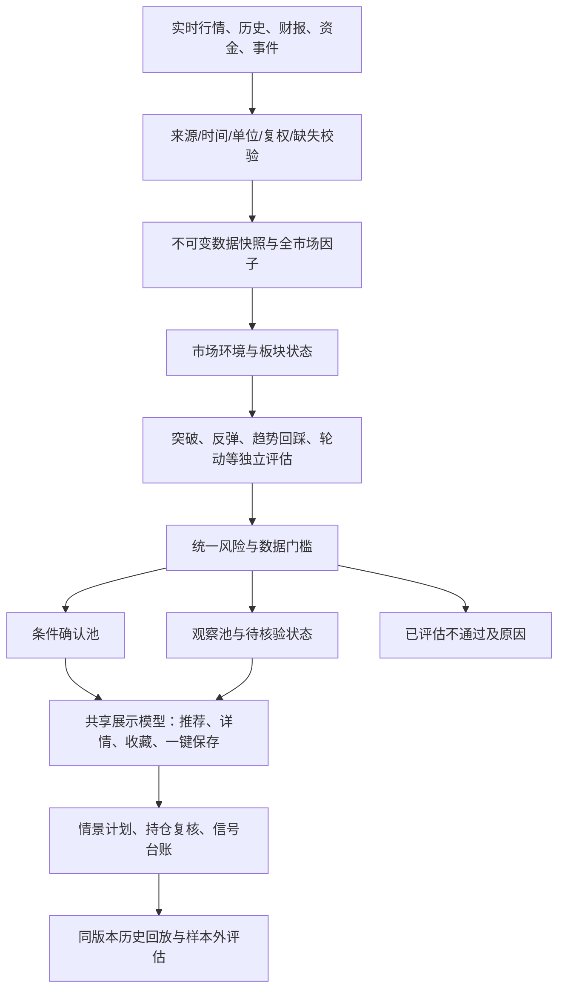

# 四项目对照：股票观察助手策略与展示优化方案

日期：2026-09-13。版本：R2.1（二次源码复核修订）。状态：P0完整性修复已部分实施，其余按阶段推进。

本地基线：`38ffbd9364bdab2db742ae58bb90d79c6aea36ed`，分支 `agent/optimize-market-search-and-portfolio`，Electron 31 / 原生 JavaScript。

## 1. 设计结论

保留现有桌面软件、收藏标签、模拟持仓和规则分析，引入四项增量能力：

1. **完整且可追溯的数据底座**：全市场历史增量入库，同一时点计算横截面因子，显示实际覆盖率。
2. **独立策略与统一裁决**：突破、反弹、趋势回踩、板块轮动分别判断；形态、消息、数据质量和入场状态分开表达。
3. **有证据的多视角个股分析**：技术、基本面、资金、事件分别给出支持、反对、缺失和失效条件；可选 AI 只解释证据。
4. **面向决策的紧凑展示**：市场环境 → 板块 → 策略股票 → 个股证据 → 持仓跟踪，列表、详情和保存界面共享数据。

首要任务是修正覆盖、评分与回放口径，再新增策略。R2进一步明确：优先复用本地已有全市场采集脚本；全量后台任务不受单次页面请求生命周期约束；数据是否完整与是否过期分别表达；收藏反馈不直接校准公共模型。四个开源项目的实现和展示提供设计参考，项目自述、规则数量、角色数量、报告评分均不是收益证明。

## 2. 调研范围与证据等级

读取四项目 README、关键源码及本地生产代码。未安装、运行外部项目，未调用其付费模型或交易接口；外部项目中的安装命令、Agent 指令和 Skill 指令仅作为研究材料。

| 项目 | 本次核对版本 | 核对方式 | 主要源码入口 |
|---|---|---|---|
| go-stock | `3b1622141becf74acc6c6c0995a55475a9880186` | GitHub API 版本与固定提交原始源码；整库克隆网络停滞后改为逐文件读取 | 指标选股工具、搜索适配、情绪词典、事实检查、操作计划、行情与推荐界面 |
| UZI-Skill | `650788c54a9b2e042bf7f983f16dbf8d727fce1d` | 浅克隆与源码检查 | pipeline/schema、score、daily_screen/ranker、execution、themes、tracker |
| TradingAgents-astock | `f1bd10f94628cd66a82550c62d8748005dbd87e2` | 浅克隆与源码检查 | graph/setup、quality_gate、trader、a_stock 数据适配、报告和进度组件 |
| Sequoia-X | `444c0db69ff36b46ef2b22ab265051d60c16029d` | 浅克隆与源码检查 | 数据引擎、策略基类、海龟、RPS、高旗形、涨停洗盘及主入口 |

“已确认”指上述固定版本的代码可见行为；“拟新增”指本方案设计；所有收益效果均未实测。研究覆盖关键链路，不等于对四个仓库做了完整安全审计或性能测试。

## 3. 四项目可借鉴的实现及边界

### 3.1 go-stock：数据工作台、工具调用和计划跟踪

已核对的指标选股工具把自然语言传给 `SearchStockApi`，由东方财富智能选股服务检索，异常时有问财降级路径；自定义策略存储名称、查询语句和说明。它提供的是检索和工具编排能力，该路径并非本地透明因子回测引擎。[G1]、[G2]

市场界面按资讯、政策、全球股指等分区；推荐表区分推荐时价格、最新价格、推荐模型和日期；每日计划将情景条件、失效点和预警持久化。[G3]、[G4]

采用：自然语言转结构化条件、行情与资讯联动、推荐历史对照、情景计划和阶段进度。实现时仍以本地规则复核外部搜索候选。

边界：其轻量事实检查只验证本轮是否存在成功工具调用，不能证明回答中每个数字都有来源；情绪词典也不能替代主体、否定语义和事件核验。[G5]

### 3.2 UZI-Skill：维度契约、证据门槛和分层报告

`DimResult` 明确 full/partial/missing/error、来源、缺失项和抓取时间；pipeline 将采集、评分与合成分段。每日筛选在同一市场横截面构建行业强弱，并检查事件证据、报价与分钟线一致性，再输出观察或等待等状态；信号追加写入台账。[U1]、[U2]、[U3]

采用：字段级质量契约、数据恢复清单、证据与执行条件分离、个股横向比较和报告分层。

边界：多个投资风格角色使用共享数据，不是相互独立的胜率投票；其每日榜有初筛和 Top-N 限制，不能照搬到本地“全部合格结果可查看”的需求。其 research_confidence 包含涨幅、题材和角色意见，不能直接作为纯数据可信度。[U2]

### 3.3 TradingAgents-astock：多视角研究与反方检查

LangGraph 实现七类分析师工具循环，随后进入多空辩论、研究经理、交易观点及风险讨论；默认分析师之间按顺序连接，并非七个任务自动并发。质量节点先做代码检查再做模型复核，结果进入后续分析。[T1]、[T2]

采用：技术、事件、资金、财务、解禁等职责分离；明确反对证据；分阶段进度；按数据类型选择适配器。其东财适配有统一节流入口。[T3]

边界：质量节点主要生成质量摘要，即使低质量也继续进入辩论；报告长度和表格不是事实真实性证明。提示词中的交易制度也必须在本地由按生效日期维护的规则表执行，不能依赖模型记忆。[T1]、[T2]

### 3.4 Sequoia-X：全市场增量历史和独立技术策略

SQLite 保存后复权历史，按股票最后日期增量补齐；策略共享数据接口，并由主入口逐个运行。海龟规则使用不含当日的过去20日最高价；RPS 使用120日收益的横截面排名；高旗形刻画强势后的收敛与缩量。[S1]、[S2]、[S3]

采用：本地历史、断点续传、独立策略、统一调度；RPS候选与突破确认分两步。

边界：RPS策略的价格条件是接近滚动高点，并非真实突破；高旗形也未要求突破触发。涨停洗盘用固定比例推断涨停，不适合直接覆盖所有板块。增量写入按日期先删后插，在部分股票成功返回时存在删除同日其他股票旧记录的风险；本地应按股票和日期幂等更新。[S1]、[S3]、[S4]

## 4. 本地软件已有能力与需优先解决的问题

已具备：市场状态识别、板块资金与轮动、反弹/突破/整理分析、消息时间衰减、统一 scoreCard、推荐台账、收藏时快照、持仓独立风险、主进程工作任务和多源降级。本方案沿用这些能力。

R2补充确认：`tests/full-market-research.cjs` 已有320根日线、财务、资金、新闻的可恢复全量采集，`tests/analyze-full-market.cjs` 已能生成生产端读取的候选缓存。缺口是未形成应用内生产任务服务、历史按日期归档与可验证发布机制，不应描述为“完全没有全市场采集”，也不应另写第二套采集器。

以下为本次静态检查确认的设计缺口；收益和实际界面影响未通过新的运行测试验证。

| 优先级 | 当前证据 | 影响 | 本方案处理 |
|---|---|---|---|
| P0 | `main.js:3650` 每轮历史精筛最多160个候选，前置队列还有行业和来源配额 | 有全市场报价不代表所有股票完成历史分析 | 预算改为排队顺序；持久化任务游标、全市场历史覆盖和待处理原因 |
| P0 | `main.js:3545` 强势追踪默认最多8只、每板块2只；`2977` 观察候选按不足8条补位 | 输出仍受数量影响，观察与严格名单耦合 | 三个池独立生成全部合格记录；10条只限制首页预览 |
| P0 | `main.js:3680` 相对收益分布来自本轮精筛样本；`3211` 个股 L 因子采用绝对收益映射 | 排名不是全市场 RPS，推荐与个股分析口径仍不同 | 全市场同日因子快照，两入口调用同一评估函数 |
| P0 | `main.js:1882` 长周期仍混合 financial、CANSLIM、trend；CANSLIM 含 C/A 财务维度 | 财务信息有重叠权重，注释“只计一次”不足以证明无重复 | 总评分按原子因子组计算；CANSLIM 作为展示投影，不再整体叠加 |
| P0 | `tests/strategy-replay.cjs:49` 按交易样本收益累加求 maxDrawdown | 结果受样本顺序影响，不是资金曲线最大回撤 | 样本收益统计与账户回放拆开；账户按交易日日净值计算回撤 |
| P0 | 同文件 `61` 缺失 CLI 成本参数经 `Number('')` 变成0 | API 有校验，但命令行会默认零成本 | 解析层强制要求参数出现，并测试 CLI 入口 |
| P0 | 同文件 `37` 的 horizon=1 使用买入当天收盘价 | 可做次日价格观察，不能直接当成已实现的普通A股隔日持仓收益 | 分开标记价格观察与可成交回放；成交由交易日历及结算规则约束 |
| P1 | `main.js:1651` 每次摘要把 firstSeenAt 设为本次 fetchedAt | 字段不能稳定表示首次观测时间 | 持久化事件首次时间，更新仅修改 lastSeenAt 与版本 |
| P1 | `main.js:1834` 数据可信度主要按六项是否存在计数 | 有数据不一定新鲜、齐全、同口径 | 改为必需字段校验、时效、单位和来源质量，明确缺失状态 |
| P1 | `renderer.js:290` 行头字段多；CSS 对首页另有换行覆盖 | 紧凑需求与窄区域展示仍有冲突 | 固定列和自适应容器；不再用无限缩小字号解决宽度 |
| P1 | `docs/PROJECT_ARCHITECTURE.md` 仍有60只精筛等旧描述 | 开发容易依过期文档误改策略 | 实施时同步文档与可执行策略配置 |
| P0 | `main.js:6846` 大盘Worker整项任务180秒超时；主进程和Worker分别有内存缓存 | 直接取消160只预算会把完整扫描压进页面请求，增加超时；跨进程限流可能失效 | 生产化可恢复后台任务；统一来源调度与发布，页面订阅进度 |
| P0 | `main.js:433` 只用交易日字符串和当前钟点判断收盘 | 15点后读取14:50快照也可能显示当日收盘 | 同时检查数据原始时间、日历与日线完成状态 |
| P0 | `main.js:444` 快照ID只精确到秒且不含内容/参数；`290` 异步直接写缓存并吞掉失败 | 同秒不同结果可同ID；多写入者和中断恢复无保证 | runId与内容快照ID分离；单写入者、原子发布、可观测失败 |
| P0 | `renderer.js:100` 收藏生成反馈样本，`main.js:2865/4057` 将反馈用于评分；去重以代码/加入时间/基价为主 | 用户选择和保存时点会改变公共模型；同信号多次保存仍可能多计 | 收藏表现独立；模型反馈只读冻结、成熟、去重的系统信号队列 |
| P1 | `main.js:5018` 直接使用最近报告同比；`5052` 用通用负债率、毛利率等门槛评财务 | 当季与累计、金融和制造行业口径未充分分开 | 财务adapter声明口径，单季/TTM派生及行业模板校验 |
| P1 | `renderer.js:93` 整体状态放localStorage，`774` 交易记录截到500笔；生产缓存路径基于可执行目录 | 全量保存扩大后存在容量/可写性问题，不能据截断交易记录重建账户 | 用户数据持久化独立迁移、备份和恢复；显示分页不裁剪账本 |

## 5. 目标分析链路



“条件确认”只代表策略条件满足，单独维护模拟交易是否具备可成交条件。数据采集未完成的股票属于待处理任务，不放进“已评估不通过”。严格/观察是裁决状态，强势追踪是可交叉的筛选视图，不能把三者人数直接相加。第7.5节规定唯一状态与计数规则。

## 6. 数据策略：先解决覆盖和时点

### 6.1 统一字段契约

沿用现有缓存接口，逐步让采集器输出以下信息，避免一次性改写全部 IPC：

```text
DataEnvelope
  schemaVersion, datasetId, source, sourceUrl
  securityId = exchange + code, currency, unit, adjustment
  tradeDate, periodEnd, sourceAsOf, publishedAt, firstSeenAt, fetchedAt
  availability = complete | partial | missing | error
  freshness = fresh | stale | unknown
  provenance = direct | derived | estimated
  sessionPhase, isFinalBar, adjustmentVersion
  coverage = expected / received / valid
  missingFields[], errorCode, data, rawHash, dependencyVersions
```

报价时间、消息发布时间、财报公告时间和抓取时间分别存储。财报期末日期不等于公开可见日期；历史回放只能读取当时已公布的版本，后续更正另存版本。日期精度消息不推定当日上午已可见；按保守可见边界或标记不可用于盘中历史判断。`availability=partial` 与 `freshness=stale` 可以同时存在，不能继续挤在单一status枚举里。

金额统一人民币元，成交量统一股，换手率和净流入占比分别声明单位。不把供应商“主力”或“大单”统计推定为真实机构身份；估算资金只能作为代理指标，不满足要求直接资金证据的规则。

历史计算价与实际交易价分开；复权模式/因子版本进入缓存键。分红送转后的序列重新校验，不能混用前复权、后复权和未复权价格。供应商降级只可替换口径相容的数据；无法证明复权相容时分开保留序列并标注缺口，不能直接拼接。

财务字段必须声明累计/单季/TTM、合并/母公司、扣非/非扣非和公告版本。单季营收/净利润可由相同口径的累计金额相减得到；EPS、ROE及同比百分比不得直接相减。负基期扭亏与正常正基期高增长分开评分。金融行业不套用制造业流动比率、毛利率模板；季节性行业使用同季及TTM比较。

### 6.2 全市场增量与任务调度

- 建立每日证券主表，维护上市、退市、停牌、板块和更名历史；历史样本不能只使用今天仍上市的股票。
- 首轮优先复用已有320根日线采集；每个因子校验所需有效观察值，250日收益至少需要251个对齐收盘点。新股、停牌和中间缺失分别记录，不能只用数组长度证明窗口完整。多年财报按披露更新，分钟数据先覆盖候选与持仓。
- 行情继续优先复用现有批量源；历史、财务、资金按各自成功率和时效选择供应商。baostock/mootdx 作为待评估适配选项，不在首期强加 Python 常驻服务。
- 先补收藏、持仓和候选，然后按游标扫描剩余股票；优先级只改变完成顺序。任务支持继续、取消、失败重试，关闭后可恢复。
- 分开显示报价覆盖、历史覆盖、财报覆盖、资金覆盖；“全量分析完成”需要所有任务进入终态，失败仍需显示。
- 每来源独立并发池、退避、熔断、请求去重和缓存 TTL；一次刷新复用正在进行的任务。HTTP成功但内容为错误页也判失败。
- 保留当前有效快照，后台完成后原子发布新快照。旧批次晚返回不得覆盖新批次；某个接口失败只影响依赖它的分析。

存储先复用 Node 文件系统与现有缓存，增加按数据集/交易日分区的压缩快照、清单和追加式台账。历史规模达到瓶颈后，才通过同一个 repository 接口迁移 SQLite；引入原生模块前必须验证 Electron ABI 和 Windows 打包。不得照搬按日期整批删除的写入方式。

### 6.2.1 从已有研究脚本迁移到生产服务

提取已有采集、重试和格式转换函数到正常运行模块，去掉生产运行对测试模块、Electron加载桩和源码拼接导出的依赖。旧研究脚本作为该服务的命令行入口保留。现有按代码覆盖的研究文件仅作为迁移输入，新记录按交易日和批次归档；旧文件没有历史公告版本时不能补造。

任务至少记录 `jobId、universeId、asOf、configHash、cursor、perStockState、attempts、heartbeat、cancelRequested`。状态为 queued/running/paused/finished/failed/cancelled，单股与每数据源分别记录结果；全部尝试结束和全部数据有效是两个统计字段。

页面请求仅启动/订阅任务；沿用Worker承载计算，但整市场后台扫描不沿用180秒整项硬截止。对单个网络请求、批次和失去心跳分别设界限；明确可重试错误与数据确实不存在。force刷新期间再收到请求时，依据数据依赖判断复用还是追加新版本任务，不能无条件复用旧Promise。

同一来源在主进程、Worker和命令行批采之间由单一服务分配预算；进程内各自“限制并发”并不等于全应用限流。全部股票的轻量技术计算完成后，可按优先级补候选财报与事件，但每个策略对每只股票均要有通过、不通过或待核验结果，不能把一次廉价预筛永久当作全量结论。

### 6.2.2 快照发布与用户数据

- `runId` 为唯一任务身份；`snapshotId` 根据规范化数据清单、asOf和内容哈希产生；`analysisId` 再关联策略版本、参数和校准版本。不同字段、相同秒钟也不能混成同一分析。
- 显示实时价格的quoteId与冻结分析的analysisId分别保存。行情更新可以先显示新价格，评分标记其分析截至时间，不伪装成同步重算。
- 使用单写入者、同卷临时文件、校验和、原子重命名和最后发布的manifest；加载只读已提交manifest。模拟“数据写完但manifest未发布”和“尾部JSONL不完整”的恢复。
- 已发布结论和其证据保留不可变版本；刷新不更新原行，追加新行。台账幂等键含analysisId/securityId/strategyId，多个IPC订阅者只能写入一次。
- 数据根目录可配置，默认使用可写用户数据目录；便携模式需检测可写性，迁移旧缓存先校验备份。原始抓取缓存可清理，已被信号引用的证据和交易账本不能随TTL删除。
- 收藏/持仓迁到有版本、备份和错误回执的主进程持久化服务。首次导入localStorage后保留原副本；未确认落盘不能提示保存成功。500条限制只作用于页面，不能丢弃完整交易记录。
- 历史扫描按分区流式读取，不向renderer发送全市场原始日线。用既有约5892只×320根数据量做基准测试，记录磁盘、峰值内存与耗时后再决定是否换SQLite；不预先承诺全市场刷新秒级完成。

### 6.3 更新节奏

候选/持仓报价、板块快照、消息、财务使用独立时效配置。盘中优先增量更新受影响的股票和板块；收盘确认由交易日历、收盘数据到齐状态和行情日期共同决定。只刷新时钟不算实时更新。

消息无需每次刷新重拉全部历史。新事件、风险变化、板块状态变化或报价越过关键位置才触发相关结论重算；显示具体数据截至时间和缓存状态。

收盘确认不能仅比较当前时间是否超过15点：须匹配交易日历、数据原始时点和最终日线。午休暂停分钟连续性检查，跨午休不能当作数据断流；只用完整分钟K或显式partial bar。整轮异步采集完成后，在发布阶段再次检查引用数据时效，避免先完成的报价在等待其他接口时已过期。

同一历史请求禁止实时补新闻、财报、板块或机构数据。回放将时钟和数据依赖显式注入；区别“原系统当时实际看见”（firstSeenAt约束）与“后来重建当时公开可见”（publishedAt/版本约束）两种研究，后者不能冒充原系统历史实绩。

## 7. 选股策略：多策略独立生成，统一风控

### 7.1 公共因子

建立 `FactorSnapshot`：securityId、asOf、universeId、modelVersion、parameterVersion、原始指标、来源引用和缺失项。

统一计算：20/60/120/250日收益、全市场RPS、行业内RPS、相对行业收益、趋势斜率、ATR、振幅收敛、量能、回撤路径、资金窗口、盈利质量、事件与板块阶段。

RPS在同一天、同一合格股票集合、同一复权口径下计算；覆盖不足显示“样本内分位”和样本数。不能用候选池分位冒充全市场排名，不能在缺少120日历史时改成60日却仍标RPS120。

RPS分母是预先定义证券池中该窗口有效的股票，另外显示相对证券池的覆盖。相同收益采用平均名次，百分位按 `(平均名次-1)/(N-1)×100`；N<2不可计算，全体并列时为50，不应人人100。零收益有效，null/空串无效。盘中RPS和收盘RPS是不同快照；历史缺失不靠拉长自然日期或换窗口悄悄填补。

### 7.2 策略注册表

每个策略输出 `strategyId / version / phase / evaluationStatus / score / requiredData / evidenceRefs / blockers / invalidation / horizon`，其中 evaluationStatus 为 pass/fail/unknown，不直接输出界面中文标签。缺数据是unknown，不能变成false。共享字段/方向/形态定义，策略参数独立且有版本。

| 策略 | 核心观察 | 确认条件 | 主要排除 | 定位 |
|---|---|---|---|---|
| 趋势突破 | 20/60日平台、均线与RPS | 收盘越过不含当日的前高，量能与趋势配合 | 过度偏离、爆量长上影、环境或公司风险 | 现有突破加强 |
| 整理后突破 | 区间振幅和ATR下降，量能收缩 | 放量突破整理上沿并收盘站稳 | 下跌中继、支撑持续走低 | 现有整理规则统一 |
| 强势首次回踩 | 历史突破已确认，回撤有限、回调缩量 | 支撑守住，恢复量价与相对强度 | 跌破原结构、资金持续恶化 | 新增独立路径 |
| 高位旗形 | 前期上涨先发生，再进入窄幅整理 | 整理结束后触发；未触发只观察 | 只满足最高/最低比但实际先高后低、末端加速 | 实验策略 |
| 底部待反弹 | 回撤后低点不再明显下移，动量改善 | 尚未恢复趋势时只列观察 | 财务恶化、流动性不足、持续破底 | 保留待反弹 |
| 已反弹/趋势修复 | 底部抬升、恢复均线、相对行业改善 | 结构与资金/量价证据达到该策略门槛 | 弱反抽、涨幅过度、重大风险 | 独立于突破准入 |
| 板块轮动延续 | 板块强度、广度、资金持续改善 | 个股领先且具有上述一种有效结构 | 单只权重股拉升、主题证据不足、板块退潮 | 组合策略 |
| 成长质量观察 | 季度/年度盈利、现金流、资产负债和估值 | 财务窗口完整，估值适合行业，趋势条件另判 | 用低PE代替质量、财报过时 | 中期研究池 |
| 涨停后承接/跌停反包 | 交易状态、封板与回踩证据 | 数据齐备后离线实验 | 缺涨停制度、封板、分钟线或可成交数据 | 首期关闭，仅研究 |

RPS、均线趋势和突破不是同一个指标，但可能高度相关；将它们放在有总权重上限的技术组，重复引用的同一因子只计一次，通过消融决定是否保留互补信息，不能简单把三者合并成一个信号。3日/5日/10日资金窗口重叠，不重复累加为三份独立买入证据；使用一个资金组表达持续性与最近转弱。

首版重构先保留可解释的既有参数作基线，修正冲突后冻结新版本；新增回踩/旗形参数登记候选值、取值范围与参数选择数据集，仅影子运行。`002631/688195/002536` 为用户提供的历史观察样本，需核对实际区间后才能称正例；`600157` 为误报观察样本。增加同期行业匹配对照、失败和退市样本，禁止按代码加分或拉黑。

### 7.3 环境与板块路由

保留 `classifyMarketRegime` 和板块阶段识别，新增状态持续性与转换证据，减少一分钟数据波动导致反复切换。

- 普涨扩散：允许突破、趋势回踩、趋势修复参与各自评估。
- 震荡轮动：提高对回踩承接和资金持续性的要求，突破需核对行业支持。
- 普跌中的局部强势：仅已核验强板块进入严格评估，其他归环境观察。
- 风险释放：保留形态事实，但限制模拟入场；不能因为股票高分绕过环境限制。
- 数据不足：关闭依赖缺失数据的准入条件，显示缺失原因，不能自动解释为普跌。

板块维护官方行业与概念多对多关系。归属以真实成分/公司业务为基础，不因今天哪一个题材涨得最好就追溯改写股票所属主线。记录板块排名、广度、等权/市值口径、资金、集中度、领涨股及变化；小样本降低可信度，不静默剔除股票。

### 7.4 评分与硬门槛

保留 `scoreCard` 兼容字段，新增结构化贡献明细。

- 推荐评分来自策略匹配度及不重复的原子因子组，不再把财务总分、CANSLIM总分、多因子总分层层相加。
- CANSLIM独立展示七维与覆盖比例；I维没有机构持仓序列时明确缺失，不用大单净流入顶替。
- 数据可信度只度量字段质量、时效、覆盖和一致性，不混入涨幅、题材热度或看多人数。
- 权重配置按策略/市场状态维护，说明原始值、贡献、缺失和扣分。缺少必需因子时进入待核验；缺可选因子时允许产生暂定分，但显示覆盖和可比范围。
- 评分不能覆盖硬风险；有重大可核验公司风险、结构失效或不满足交易条件时，分数再高也不生成入场许可。
- 同一股票允许多个独立策略匹配，但每个策略内部阶段唯一；去重后的主列表以 securityId 为准，详情显示全部匹配策略。

严格池、观察池、风险排除记录分别统计，观察池不再只负责“补够8条”。总数统计股票数，策略分项是匹配次数，二者明确命名，避免再次出现标签数量对不上。不同策略评分不是上涨概率；跨策略预览先依裁决等级与固定策略顺序轮询，组内按版本一致的评分排序，不把未经校准的各策略分数直接混排或取最高分。

### 7.5 裁决、状态与多周期冲突

统一裁决优先级：已核验硬风险 → 必需数据是否齐备 → 策略形态是否满足 → 环境是否允许 → 执行条件。通过一个形态不能覆盖其他层的限制。风险记录含 severity、scope、effectiveFrom、expiresAt/resolvedAt、evidenceRefs，而不是靠中文状态文本匹配。

| 情形 | 策略状态 | 股票主状态 | 是否允许研究模拟入场 |
|---|---|---|---|
| 收盘突破成立但存在有效公司硬风险 | 形态通过，风险阻断 | excluded | 否 |
| 技术条件良好，局部行情中行业关联未核验 | 形态通过，环境unknown | pending-data | 否 |
| 数据够用但仍等待突破/反弹触发 | 观察 | watch | 否 |
| 结构成立，条件齐备但报价已过期 | pass，执行待核验 | watch | 否 |
| 某策略全部准入条件通过且执行可核验 | pass | confirmed | 还需账户额度与交易规则复核 |
| 数据齐备，所有策略均不满足 | fail | excluded | 否；可查排除原因 |

运行态股票分区必须守恒：`证券池=范围外+未评估+待数据+已排除+观察+确认`，六类互斥。强势追踪是watch/confirmed等状态上的额外筛选，不加入上述求和；详情保留策略维度匹配次数。最终显示的主策略必须依据固定优先级/已选持有周期产生，不能受接口返回顺序影响。

阶段维护 startedAt、confirmedAt、invalidatedAt、confirmationBars、phaseReason。盘中突破只能preview；确认后的回踩有独立状态，不能一根阴线直接退回“从未突破”。失效后再次确认需要新阶段记录。形态、环境、消息与执行状态分别展示，避免用同一个标签表达全部含义。

短线与中期结论分别输出，允许“短线改善、中期基本面不足”；中期财务门槛不无条件封杀短线观察，而有效硬风险跨周期生效。缺机构序列只使CANSLIM I维缺失；普通技术策略不强制“全部22维完整”，公司事件催化策略则必须有公司事件证据。这样既不因一个接口缺失全市场归零，也不把unknown当通过。

### 7.6 反馈校准边界

收藏收益继续服务用户个人复盘，但不直接修正公共推荐。系统信号台账包含全部已评估结果、signalId、首次发布时间、参数/模型版本、证券池和证据引用；同一信号跨标签、跨刷新只统计一次。

校准仅使用在校准截止时已到期的固定持有期结果；按策略、持有期、环境和版本分组，保存calibrationVersion并纳入分析/缓存身份。不使用“加入收藏至今”的混合长短收益估计同一策略效果。

首期校准只出诊断建议；样本门槛、收缩幅度和允许调整范围经离线确定后，才将已冻结的校准版本用于新信号。运行时禁止根据几条最新盈亏自动改变权重。基准缺失保持null，不用0收益代替；同类样本中位数是相对样本指标，不标成行业或市场超额。

## 8. 实时消息与产业关联

将现有 `summarizeNews` 升级为结构化事件管线：原文 → 去重 → 主体识别 → 来源核验 → 影响路径 → 时效 → 策略复评。

事件包含 eventId、原始来源、首发/转载关系、publishedAt、firstSeenAt、lastSeenAt、涉及公司、事件类型、状态、量化内容、关联证据及 supersedes。转载不增加独立证据数量；澄清、取消、合同终止会使旧事件失效。

“来源可靠”“公司确实相关”“事件方向”“持续时间”分别计算。例如新订单需要公司、合同和金额证据，才讨论相对收入的重要性；政策利好需要产品/客户/产能联系，不能把关键词命中当作受益确认。风险事件按有效状态持续跟踪，不能机械地因超过72小时就消失。

产业搜索输出四级关系：已核验项目参与、已核验产业链联系、行业候选、关联待核验。机场/铁路查询必须保存“公司—角色—项目—地点—有效期—证据”的关系链；同省份、同名地名或经营航线不自动等于项目受益。

消息只更新被影响股票与板块。没有新消息与消息源获取失败分别显示；盘口强不反过来证明新闻为真。

## 9. 个股分析与可选 AI

推荐和详情统一调用 `evaluateStock(snapshot, strategyConfig)`。详情刷新拿到更新快照时，明确标记“推荐时”和“当前”，同一快照同一分数；历史收藏记录保留原时点，并引用最新分析而非覆盖历史。

报告分三层：

1. 概览：当前状态、适用周期、主要支持、主要风险、下一步确认条件。
2. 证据：技术结构、资金、板块、财务/估值、消息/供给风险各一张面板，含原始值、来源时间、支持与反对。
3. 详细研究：多股比较、情景假设、历史变化、因子贡献和回放同类样本。

设计四种分析视角：趋势、基本面、事件、风险。它们可先由确定性规则生成结构化结果；不要求四个LLM，也不按“看多人数”表决。冲突摘要必须写明“短线结构改善但财务不满足中期策略”这类具体分歧，不能只给综合乐观分。

AI深度解释为可选能力，由用户配置模型后按单股触发。限定可读工具、费用/次数预算、取消与超时；所有数字须引用 evidenceId，输出通过 JSON schema、数值来源和时点校验后再发布。模型建议不能修改原始数据、确定性评分或硬性风控。模型故障时保留规则报告，并标记解释未完成。

DCF只在自由现金流、净债务及明确预测假设齐全时作为情景研究，展示敏感性区间；不同金融/周期行业采用适合的估值方法。不会因为引入外部项目就自动生成“精确目标价”。

## 10. 展示方案

### 10.1 大盘与推荐

顶部显示交易日、观测阶段、市场状态、上涨广度、成交口径、数据覆盖与刷新状态。中部是板块列表：阶段、相对强弱、广度、资金、持续性、候选数，可点击过滤。

推荐区提供严格、观察、强势追踪三个入口，按主板块分组；强势追踪为可能与前两者重叠的视图，各入口显示去重数量，不将入口数量相加。待核验可从数据覆盖入口查看。同一板块相邻显示，分组标题承担板块标签，个股行不重复占位。默认前10只预览，“查看更多”显示完整集合。

推荐行保持股票名称、代码、主要形态、消息、周期和价格同一行；不加“现价”文字。数据行显示推荐评分、CAN、涨跌幅，说明和证据展开查看。其他匹配策略在详情完整列出，行头不无限追加标签。价格、百分比使用等宽数字。

最小布局能力需要明确：为行头设最小内容宽度，优先扩大/可拖动侧栏；实际容器小于该宽度时在列表容器内横向滚动，不能裁掉股票名称或标签，也不能无下限缩小字号。保留键盘访问和完整文本。实施验收覆盖100%、125%、150%缩放及长名称。

### 10.2 一键保存

顶部固定显示目标标签、创建标签、已选数量；下面复用推荐行组件与相同分组。已选数用强调色显示。全选按钮在全选/取消全选间切换，明确作用范围为当前筛选结果；更改筛选不丢失已选股票。跨页全选按记录ID管理，不能依赖当前DOM中已渲染的复选框。

底部固定保存操作。保存内容包括股票、目标标签、策略状态及快照引用；股票按代码去重，一只股票可保存多个标签。

打开弹窗时冻结结果版本、排序和选择集合；实时行情可单独更新并标注时点，但不得自动跳动排序或替换待保存信号。若有新分析，显示“有更新，可重新载入”。大列表按稳定ID分页或窗口化渲染，全选作用于查询结果而非屏幕内的行；保存前显示总选中数、当前可见选中数和快照版本，防止隐藏选择被误解。

### 10.3 个股、收藏和持仓

- 个股先展示结论和证据冲突，再显示指标详情；图上叠加突破位、支撑、失效点和消息时间标记，均标明计算时点。
- 收藏保留“评分 XX CAN XX”左对齐、涨跌幅右对齐、中部留空。提供推荐时/当前快照切换，不能把历史CAN与当前推荐分混在同一行。
- 持仓紧凑显示成本、数量、当日和累计收益、原策略状态及风险；保留刷新与批量操作。新增板块/主题集中度，主题重叠需说明去重口径。
- 计划包含触发、等待、失效三种情景；市场转弱触发重新评估，不以“今日未推荐”自动卖出。
- 数据失败面板显示具体失败项、已有数据截至时间和单项重试，不清空整页。

现有模拟买卖实际是成本/持仓记账，不能在迁移时暗中重算成历史真实撮合结果。保留旧记录为legacy-log；新增研究模拟账户另设accountId、现金、订单、成交、可卖批次、费用与公司行动，使用经生效日期验证的交易规则。未知买入日期的旧持仓不伪造可卖日期；旧版截断的交易不补造。推荐数量无上限不等于资金、持仓集中度无约束；批量研究订单先检查总预算，再按固定顺序分配并逐笔回报，失败项不伪装成全部成功。

### 10.4 零结果与进度

进度显示：证券总数 → 报价有效数 → 历史覆盖数 → 已评估数 → 条件通过数 → 风险通过数，同时列出待处理/缺数据/不通过原因。

空列表区分“全量评估后没有符合条件”“任务尚未完成”“接口失败导致暂不可评估”。允许查看观察池与排除原因；不得降低门槛凑数，也不得宣称未分析股票均不符合。

## 11. 验证与策略评价

### 11.1 首批工程验收

1. 相同快照下推荐、个股、收藏当前视图和保存弹窗的分数、阶段完全一致。
2. 多策略同股去重，但匹配次数可追溯；同策略不存在待突破/已突破或待反弹/已反弹冲突。
3. 超过160个有效候选时后续能继续评估；强势追踪和观察池不被8条硬截断。
4. 数据失败与0净流入、无新闻、股票停牌有不同状态；部分成功更新不损坏已有其他股票历史。
5. 同一事件多次刷新 firstSeenAt 不变；未来消息、未公布财报和后续更正不能进入旧时点。
6. 缺CLI成本参数必须失败；价格观察不冒充成交收益；资金曲线回撤与样本收益排序无关。
7. 首页10条与全部列表对应；筛选、分组、跨页多选、长名称和高DPI不丢内容。
8. 同一刷新连续触发只运行一份数据任务，旧请求不能覆盖新快照；取消与恢复不重复写台账。
9. 同秒不同内容/参数得到不同analysisId；缓存键包含数据依赖与校准版本；重复发布只追加一次信号。
10. 15点后收到盘中旧报价仍不能标收盘确认；只有日期的公告不能用于当日上午；历史模式调用实时采集器必须被拒绝。
11. 全体相同收益时RPS为50，单样本不可算；新股、停牌、复权变化不改变窗口名称或掩盖缺失。
12. 数据同时partial和stale时两个问题均展示；公司风险不能被其他策略高分覆盖；主状态分区守恒。
13. 复制股票到多个标签、删除个人收藏不改变公共评分；不同持有期和模型版本的校准记录不混用。
14. 部分写入/断电模拟可恢复；用户目录只读/磁盘满时保存失败可见，旧收藏备份仍可恢复；页面翻页不截断账本。
15. 打开保存弹窗后后台刷新不改变选择对应的analysisId；跨页全选与最终保存数量一致。

### 11.2 策略有效性

先建立冻结信号、证券池、历史行业归属、当时可见财务和新闻，再进行时间顺序训练/验证/样本外测试。重叠持有期应隔离，测试集不用于回调阈值。

同时报告：样本数、覆盖、1/3/5/10/20/60日观察收益、成交可行比例、真实持仓期收益、最大有利/不利波动、换手、费用、日净值最大回撤、市场和行业超额。多股同日信号的资金约束、重复持仓、退出顺序均写入撮合模型。

以旧版v16为基准，对新增模块逐项消融：只加全市场RPS、再加回踩、再加事件、再加板块阶段。按上涨、震荡、下跌和局部行情分层；同时记录未推荐股票，避免只研究收藏赢家。

先离线回放，再以不影响正式结果的影子模式积累前瞻记录。上线要求固定的数据正确性测试全部通过，并在事先声明的样本外区间满足风险与成本后表现标准；样本不足则继续观察，不能以少量高收益个股证明策略改进。

数据/展示修复与收益策略上线分开验收：前者通过一致性、兼容及性能测试即可发布；新增策略须额外通过影子验证。硬缺陷修正后若数值有变化，应保留旧版对照说明，不能为了让旧快照分数不变而保留错误。

研究模拟采用按交易日对齐的现金和持仓净值；价格观察可以有1日结果，但成交收益不得违反可卖规则。停牌、价格限制或缺报价不能直接删除失败交易以美化收益，分别记录未成交、延迟退出或估值待定。相同K线同时触及止损和目标时，日线无法证明先后，应使用明确的保守假设或分钟证据，报告假设影响。基准严格对齐实际起止日期，缺失时超额收益不可用。

验证阈值先声明后评估：每次实验固定证券池、策略参数、成本/滑点、历史范围、基准、主要指标、最大容忍退化和样本要求。进行多参数搜索时保留试验总数，按交易日分组统计不确定性，不能把同日大量相关股票当成独立样本。检查行业中性/市值分层及移除消息、资金、RPS的消融，识别只在特定行业或行情有效的规则。

## 12. 实施拆分与本地代码落点

| 阶段 | 交付 | 主要落点 | 前置/完成标准 |
|---|---|---|---|
| P0-A | 统一计数/状态、稳定快照ID、隔离收藏反馈、修正回放入口与指标 | 主进程快照/门槛/缓存；`tests/strategy-replay.cjs` | 不取消任务保护就一次性放大全量请求；状态分区与指标正确 |
| P0-B | 数据契约、日历/最终日线校验、原子因子与两入口一致 | 财务adapter、两入口因子、持有期函数 | 先具备时点/数据依赖契约；同数据同结论，无隐式缺值通过 |
| P1-A | 将已有全量采集生产化、增量归档、单写入与任务恢复、用户数据迁移 | `tests/full-market-research.cjs`/`analyze-full-market.cjs`抽取；正常data/jobs模块 | 复用已有采集；脱离180秒请求；恢复与打包数据路径验证通过 |
| P1-B | 全市场RPS与独立策略注册表 | `analyzeHistory`、`analyzeConsolidationBreakout`、`analyzeTrendContinuation`、门槛函数 | 完整历史快照可用；旧策略逐项迁移对照 |
| P2-A | 推荐/保存/详情共享展示模型，板块与证据交互 | `renderer.js`、`styles.css`、`index.html`、`preload.js` | 一致性与Electron交互回归通过 |
| P2-B | 事件产业关系、情景计划和持仓集中度 | 行业workflow、新闻、模拟持仓 | 已核验关系和行业候选分层，旧收藏可兼容读取 |
| P3 | 可选AI解释、研究模拟账户、完整回放与策略实验面板 | 独立research/replay模块 | 证据契约与回放数据到齐；旧记账不被改写，执行/成本可核验 |

只在接触相关逻辑时逐步抽取纯函数，避免将7000行主文件一次性重构。新增模块候选为 `lib/data-envelope.js`、`lib/factors.js`、`lib/strategy-registry.js`、`lib/decision.js`、`lib/analysis-view-model.js`；稳定后再细分。

每个阶段单独提交、记录模型与参数版本、增加旧快照读取适配。持久化数据增加schemaVersion，读取旧数据迁移到新结构但不改写历史结论。新增运行模块需要同步 `package.json` 的 `build.files`，否则开发模式正常而安装包会缺文件。

最终软件变更的验证顺序为离线确定性测试 → 有超时的接口契约测试 → Electron UI → Windows打包烟测。本文只新增设计文档，因此没有重跑软件测试，也没有把上次155项测试当作本方案的实施验收。

R2依赖顺序：状态与身份契约 → 持久化/后台任务 → 全市场因子 → 策略迁移及统一裁决 → 共享展示 → 影子实验/研究模拟。P0-B可先统一现有样本口径，但只有P1-B完成全市场快照后才改称全市场RPS。全量结果解除截断随生产后台服务一起交付，不能只删除slice/limit。

## 13. 采纳边界

不整体迁移Go/Wails、Python/LangGraph或新前端框架；先在当前Electron架构实现公共数据和确定性策略。外部项目源码仅作参考，直接复用前核对实际文件许可证及分发义务；本地MIT项目与go-stock标示的GPL-3.0许可不能假定可无条件混合。首期采用概念借鉴和独立实现。

不直接采用角色人数、榜单名次或广告式回测收益作为投资结论。不启用任意脚本执行、自动安装外部Skill、自动真实交易。交易规则需要官方来源与生效日期，外部提示词中的常量不作为权威规则库。

## 14. 固定提交源码索引

以下链接固定到本次读取提交，便于后续实施复核。

- [G1：go-stock 指标选股工具](https://github.com/ArvinLovegood/go-stock/blob/3b1622141becf74acc6c6c0995a55475a9880186/backend/agent/tools/choice_stock_by_indicators_tool.go)
- [G2：搜索数据适配](https://github.com/ArvinLovegood/go-stock/blob/3b1622141becf74acc6c6c0995a55475a9880186/backend/data/search_stock_api.go)
- [G3：推荐历史界面](https://github.com/ArvinLovegood/go-stock/blob/3b1622141becf74acc6c6c0995a55475a9880186/frontend/src/components/aiRecommendStocksList.vue)
- [G4：每日操作计划](https://github.com/ArvinLovegood/go-stock/blob/3b1622141becf74acc6c6c0995a55475a9880186/backend/data/tool_daily_operation_plan.go)
- [G5：轻量事实检查](https://github.com/ArvinLovegood/go-stock/blob/3b1622141becf74acc6c6c0995a55475a9880186/backend/agent/agent_fact_check.go)
- [U1：UZI数据契约](https://github.com/wbh604/UZI-Skill/blob/650788c54a9b2e042bf7f983f16dbf8d727fce1d/skills/deep-analysis/scripts/lib/pipeline/schema.py)
- [U2：每日候选评分与门槛](https://github.com/wbh604/UZI-Skill/blob/650788c54a9b2e042bf7f983f16dbf8d727fce1d/skills/deep-analysis/scripts/lib/daily_screen/ranker.py)
- [U3：执行证据检查](https://github.com/wbh604/UZI-Skill/blob/650788c54a9b2e042bf7f983f16dbf8d727fce1d/skills/deep-analysis/scripts/lib/daily_screen/execution.py)
- [T1：TradingAgents图编排](https://github.com/simonlin1212/TradingAgents-astock/blob/f1bd10f94628cd66a82550c62d8748005dbd87e2/tradingagents/graph/setup.py)
- [T2：质量审核](https://github.com/simonlin1212/TradingAgents-astock/blob/f1bd10f94628cd66a82550c62d8748005dbd87e2/tradingagents/agents/quality_gate.py)
- [T3：A股数据适配](https://github.com/simonlin1212/TradingAgents-astock/blob/f1bd10f94628cd66a82550c62d8748005dbd87e2/tradingagents/dataflows/a_stock.py)
- [S1：Sequoia-X增量数据引擎](https://github.com/sngyai/Sequoia-X/blob/444c0db69ff36b46ef2b22ab265051d60c16029d/sequoia_x/data/engine.py)
- [S2：海龟突破](https://github.com/sngyai/Sequoia-X/blob/444c0db69ff36b46ef2b22ab265051d60c16029d/sequoia_x/strategy/turtle_trade.py)
- [S3：RPS候选](https://github.com/sngyai/Sequoia-X/blob/444c0db69ff36b46ef2b22ab265051d60c16029d/sequoia_x/strategy/rps_breakout.py)
- [S4：涨停后洗盘规则](https://github.com/sngyai/Sequoia-X/blob/444c0db69ff36b46ef2b22ab265051d60c16029d/sequoia_x/strategy/limit_up_shakeout.py)

补充入口：[go-stock](https://github.com/ArvinLovegood/go-stock)、[UZI-Skill](https://github.com/wbh604/UZI-Skill)、[TradingAgents-astock](https://github.com/simonlin1212/TradingAgents-astock)、[Sequoia-X](https://github.com/sngyai/Sequoia-X)。

## 15. R2二次复核依据与结论

复核结论：R1总体方向保留，但其数据status、三池计数、后台任务和反馈模型边界不够精确；直接按原文实施仍可能产生空推荐、评分不一致、缓存误用及回放失真。本次已在对应章节修订，而非只增加愿望清单。

| 复核来源 | 新确认的实现 | 本地设计修订 |
|---|---|---|
| [UZI frozen运行与发布时复查](https://github.com/wbh604/UZI-Skill/blob/650788c54a9b2e042bf7f983f16dbf8d727fce1d/skills/deep-analysis/scripts/lib/daily_screen/runner.py) | 冻结快照禁止实时enrich，发布前再次检查报价 | 历史模式禁止实时兜底，发布阶段复验时效 |
| [UZI事件时间](https://github.com/wbh604/UZI-Skill/blob/650788c54a9b2e042bf7f983f16dbf8d727fce1d/skills/deep-analysis/scripts/lib/daily_screen/events.py) | 日期精度证据采用保守时间边界 | 公告时间精度及可见时间模型 |
| [TradingAgents checkpoint](https://github.com/simonlin1212/TradingAgents-astock/blob/f1bd10f94628cd66a82550c62d8748005dbd87e2/tradingagents/graph/checkpointer.py) | 按股票持久化恢复，thread_id由股票与日期生成 | 采用可恢复任务思想，但本地身份还包含参数/数据版本，不能同股同日误复用 |
| [go-stock推荐回测](https://github.com/ArvinLovegood/go-stock/blob/3b1622141becf74acc6c6c0995a55475a9880186/backend/agent/recommend_backtest.go) | 低频处理成熟记录；已回测集合只按推荐ID；基准初值为0 | 借鉴成熟任务队列；本地结果键须带持有期和版本，缺基准不能按0 |
| [Sequoia-X增量及RPS](https://github.com/sngyai/Sequoia-X/blob/444c0db69ff36b46ef2b22ab265051d60c16029d/sequoia_x/data/engine.py) | 增量按已有股票最后日期补齐，RPS读取横截面历史 | 补证券主表变动、中间缺失、数据发布和横截面完整性校验 |

本地补读了全量采集/分析脚本、Worker、磁盘缓存、收藏反馈、财务与模拟成交路径。只读运行两项最小探针：同一秒内两次不同毫秒的 `marketSnapshotId` 返回相同ID；`resolveObservationPhase` 在15点后返回closed且接口不接收日线完成状态。后者证明当前函数不能单独判断行情是否已收盘，不代表本次运行了真实行情故障复现。

## 16. P0实施记录（2026-09-13）

本轮已完成并纳入自动测试：

1. 推荐输出不再通过最终展示函数按固定数量补齐或截断；所有通过门槛的候选均可进入结果，同时按股票代码去重。界面仍可只预览前十条，但数据层不隐藏合格结果。
2. 强势追踪的默认总数和板块数不再设隐式上限；只有调用方显式传入限制时才限制，并按股票代码去重。
3. 收藏收益行标记为 `favorite` 来源，公共推荐校准明确排除该来源，避免用户选择偏差污染公共模型。收藏仍可用于个人复盘；独立个性化排序尚未实施。
4. 推荐模型版本升级到 `v18`，快照身份加入毫秒、内容/配置身份摘要，避免同一秒刷新碰撞及旧模型缓存混用；`v18`同时标识行情源时间和上游截断补漏后的结果，避免复用早期`v17`缓存。
5. 观察阶段接口增加行情源时间和最终日线状态；历史交易日仍可确认，当日只有本地时间和数据源状态都满足时才判定收盘。生产数据源后续还需补齐可靠的最终日线字段。
6. 回放拆分为“信号观察收益”和“账户组合收益”。账户回放显式要求初始资金、最大持仓数和持有期，按下一交易日开盘、交易成本、滑点、A股100股整手、现金与持仓约束生成逐日净值及真实回撤。
7. 复核补漏：移除观察候选上游残留的20只截断；外层大盘与推荐构建复用同一快照身份；腾讯行情原始时间参与收盘状态判断，行情内容摘要进入快照ID。

本轮未声称完成：后台全市场增量数据库、横截面因子仓、事件发布时间模型、公共推荐台账自动归因、独立个性化排序、多策略组合优化和完整界面改版。这些仍按第10—13节推进。当前页面请求内的历史精筛仍受计算预算约束，因此“最终结果不截断”不等于“已完成全市场逐股深度分析”。

未执行四个外部项目；其固定提交源码仍仅作为设计参照。本轮运行本地语法、策略回放和主冒烟测试，网络型股票池用例存在超时波动，须与确定性逻辑回归分开看待。

<!-- 固定提交引用，供正文中的来源编号跳转 -->
[G1]: https://github.com/ArvinLovegood/go-stock/blob/3b1622141becf74acc6c6c0995a55475a9880186/backend/agent/tools/choice_stock_by_indicators_tool.go
[G2]: https://github.com/ArvinLovegood/go-stock/blob/3b1622141becf74acc6c6c0995a55475a9880186/backend/data/search_stock_api.go
[G3]: https://github.com/ArvinLovegood/go-stock/blob/3b1622141becf74acc6c6c0995a55475a9880186/frontend/src/components/aiRecommendStocksList.vue
[G4]: https://github.com/ArvinLovegood/go-stock/blob/3b1622141becf74acc6c6c0995a55475a9880186/backend/data/tool_daily_operation_plan.go
[G5]: https://github.com/ArvinLovegood/go-stock/blob/3b1622141becf74acc6c6c0995a55475a9880186/backend/agent/agent_fact_check.go
[U1]: https://github.com/wbh604/UZI-Skill/blob/650788c54a9b2e042bf7f983f16dbf8d727fce1d/skills/deep-analysis/scripts/lib/pipeline/schema.py
[U2]: https://github.com/wbh604/UZI-Skill/blob/650788c54a9b2e042bf7f983f16dbf8d727fce1d/skills/deep-analysis/scripts/lib/daily_screen/ranker.py
[U3]: https://github.com/wbh604/UZI-Skill/blob/650788c54a9b2e042bf7f983f16dbf8d727fce1d/skills/deep-analysis/scripts/lib/daily_screen/execution.py
[T1]: https://github.com/simonlin1212/TradingAgents-astock/blob/f1bd10f94628cd66a82550c62d8748005dbd87e2/tradingagents/graph/setup.py
[T2]: https://github.com/simonlin1212/TradingAgents-astock/blob/f1bd10f94628cd66a82550c62d8748005dbd87e2/tradingagents/agents/quality_gate.py
[T3]: https://github.com/simonlin1212/TradingAgents-astock/blob/f1bd10f94628cd66a82550c62d8748005dbd87e2/tradingagents/dataflows/a_stock.py
[S1]: https://github.com/sngyai/Sequoia-X/blob/444c0db69ff36b46ef2b22ab265051d60c16029d/sequoia_x/data/engine.py
[S2]: https://github.com/sngyai/Sequoia-X/blob/444c0db69ff36b46ef2b22ab265051d60c16029d/sequoia_x/strategy/turtle_trade.py
[S3]: https://github.com/sngyai/Sequoia-X/blob/444c0db69ff36b46ef2b22ab265051d60c16029d/sequoia_x/strategy/rps_breakout.py
[S4]: https://github.com/sngyai/Sequoia-X/blob/444c0db69ff36b46ef2b22ab265051d60c16029d/sequoia_x/strategy/limit_up_shakeout.py

## 17. R2.1落地状态（2026-09-14）

代码版本 `2026-09-14-strategy-platform-v19` 已完成方案中的工程闭环：数据状态契约、内容快照身份、收盘最终性校验、原子持久化与备份、可恢复全市场后台任务、20/60/120/250日横截面因子、独立策略注册表、统一风险裁决、三池展示、冻结保存快照、消息首次发现生命周期、用户数据迁移、证据约束AI入口、现金受限回放和独立研究账户。

全市场历史任务与大盘快速刷新分离；任务失败股票会在恢复时重试。后台结果未补齐资金、消息和未来风险时只发布到观察候选，不能进入严格推荐。旧模拟持仓保持原口径，研究账户单独记录费用、T+1、现金、持仓、成交和拒绝原因。

“全部落地”指设计中的软件能力和确定性测试已实现，不代表收益目标已被验证。依赖跨市场周期的冻结信号、历史新闻和当时可见财务数据的样本外收益验收仍只能随时间积累；当前不得用少量收藏或单日行情声称策略有效。
