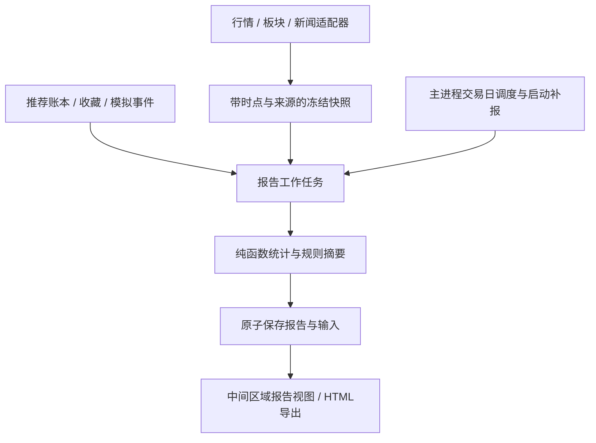

# 全局收盘报告与推荐策略优化设计

日期：2026-09-18。状态：首期已落地并完成自动化验证。

## 0. 落地状态

- 已新增15:30收盘报告、启动补报、休眠恢复和有界重试；关闭软件后不保留后台进程。
- 已新增软件内报告视图，可切换全部、方案A、方案B、最佳10和最差10；也可点击“浏览器打开”直接查看本地UTF-8 HTML。
- 报告冻结大盘、板块、推荐、收藏、模拟账户和消息；固定时点缺少可靠发布时间时明确降级，不用当前数据伪造历史。
- 推荐账本升级为schema 2并按日分片；旧月度账本通过工作线程流式迁移，损坏行和未完成尾行单独记录。
- 相同业务输入重复生成保持同一修订，数据变化才产生新修订；JSON、HTML、清单和索引均采用受控本地路径保存。
- 首期只增加影子角色和报告复盘，不根据短样本自动替换方案A/B的默认选股门槛。

## 1. 目标与已确认边界

目标不是把推荐数量或最高收益做漂亮，而是可核验地回答：资金去了哪里，当时推荐了什么，是否可以买到，T+1之后表现如何，哪些规则应继续验证。

- 保留方案A「稳健轮动」和方案B「强势追踪」，保留短线、波段、中长线标识。
- 每个交易日北京时间15:30尝试生成全局收盘报告。
- **用户已确认：软件未运行时不保留后台进程；下次启动自动补生成。** 不创建系统计划任务，不自动拉起软件。
- 报告只读行情、推荐、收藏和模拟账户；不自动下单，不修改收藏，不把盘后推荐补成盘中推荐。
- 参考图片的板块分组和明细表，但修正收益口径，增加全量、最差、缺失和未成交统计。
- 公开数据不足时明确缺失。不能用今日消息、当前资金或当前成分股伪造历史推荐依据。
- 当前工作树已有v23策略改动及9月17日复盘文档，本设计不覆盖这些改动。

## 2. 本次读取的证据

### 2.1 数据范围与时间

本次读取本地收藏、9月推荐账本、最近大盘缓存及相关代码，并通过现有腾讯行情适配器重新获取行情。

| 证据 | 读取结果 |
| --- | --- |
| 最新行情 | 2026-09-18 16:35:05，5914条，交易日期均为09-18，本次请求错误0条 |
| 大盘缓存 | 2026-09-18 16:30:55，模型 `2026-09-17-strategy-platform-v23` |
| 收藏状态 | `data/user-state.json`，更新时间09-18 16:31:43 |
| 历史推荐 | `data/recommendation-ledger/2026-09.jsonl`，约365.8 MB |
| 本次诊断留档 | `cache/design-review-2026-09-18.json`，本地忽略文件，不上传私人数据 |

时间均按北京时间展示。行情、收藏和大盘并非同一秒快照，不能描述为完全同步采样。此次没有重新执行全市场推荐，也没有验证所有接口都已恢复。

### 2.2 最近五个交易日

以下为账本中各交易日当日最后一份可读取记录，不是固定15:30报告；推荐数量是该条记录的A/B列表长度，包含观察项，不代表可立即买入数量。

| 交易日 | 记录时间 | 上涨/下跌 | 成交额，万亿元 | A/B数量 | 当时模型 |
| --- | --- | --- | --- | --- | --- |
| 09-14 | 23:53:43 | 3126 / 2223 | 1.6424 | 6 / 7 | v20 |
| 09-15 | 23:58:43 | 1120 / 4375 | 1.6249 | 2 / 8 | v22 |
| 09-16 | 23:53:42 | 4170 / 1188 | 1.8521 | 2 / 4 | v22 |
| 09-17 | 15:32:21 | 2576 / 2819 | 1.8363 | 7 / 14 | v23 |
| 09-18 | 16:30:55 | 4234 / 1151 | 2.0925 | 8 / 15 | v23 |

9月18日成交额较17日收盘口径约增加13.96%，属于放量普涨，而非仅推荐股票走强。不同日期有不同模型和采样时间，不能直接用数量变化证明策略升级有效。

18日缓存中半导体涨4.35%、主力净流入约182.20亿元；电子大类净流入约198.54亿元。两个板块有成分重叠，**不能相加作为总流入**。行业和概念排名必须保留各自来源、分类层级和排名总体，不能混排后解读成同一个名次。

最新资金警告仍为：部分候选未取得逐日明细，有真实多日汇总130只，量价代理0只。因此可以说“多日累计净流入”，不能说“连续多日流入”或推算每天金额。金十消息源本轮出现 `read ECONNRESET`，已使用新浪来源，不等于消息覆盖完整。

### 2.3 收藏观察结果

排除「重点关注」「personal」共34条。剩余样本中81条到达最早T+1可卖日期，10条尚未到达。这里的“成熟”不代表已持有满短线、波段或中长线目标周期。

| 指标 | 结果 | 解释 |
| --- | --- | --- |
| 收藏参考价累计涨跌均值 | +1.31% | 不是实际成交收益 |
| 中位数 / 正收益比例 | 0.00% / 49.4% | 收益并不普遍 |
| 有指数基准样本 | 64条 | 不把缺基准样本填0 |
| 相对指数均值 / 中位数 | -0.17 / -1.60个百分点 | 多数没有跟上市场 |
| 跑赢指数比例 | 31.3% | 普涨不能算选股能力提升 |
| 有行业基准样本 | 63条 | 与指数样本集合不同 |
| 相对行业均值 / 中位数 | 0.00 / -2.37个百分点 | 同行业选择能力仍需验证 |
| 跑赢行业比例 | 33.3% | 不能只归因于板块方向 |

分组例子：0914上午稳健5条均值-1.98%、中位数-1.68%；0915上午积极4条均值+9.49%、中位数+2.40%；0917上午积极3条均值-0.83%，正收益比例0%。样本小、持有期不同，不能按这些分组直接调权重或宣布某方案胜出。

结论：需要同时改善板块内选股、入场位置和持有期评价；不是简单放宽阈值增加数量。收藏属于用户选择后的观察样本，仍保持 `calibrationEligible: false`，用于发现问题，不直接用于模型自动校准。

### 2.4 推荐与显示问题

18日A列表有8只，但「严格推荐」中仍包含“等待回踩”“疑似吸筹，等待确认”。B列表15只也主要是等待首次回踩或不追高。今后将**研究分层、形态状态、交易权限分列**，不能把高评分或严格研究筛选等同于现在可以买。

旧账本 `generatedAt` 来源于请求开始时间 `result.fetchedAt`，不是发布完成时间。现存09:53或09:59批次不能仅靠这个字段宣称“10:00前已推荐”。这一时间缺口必须先修，再做图片式盘中推荐归因。

## 3. 图片中收益口径的修正

保留图片中的代码、名称、板块、组别、当时涨幅、收盘涨幅及板块汇总。将“买入后/收益”改为明确口径：

```text
涨幅变化（百分点） = 收盘相对昨收涨幅 - 推荐时相对昨收涨幅
推荐后价格表现（%） = (收盘价 / 推荐发布时参考价 - 1) * 100
模拟净收益 = 按实际模拟成交、费用、滑点、持仓批次计算
```

图片中华天科技2.26%到10.01%，涨幅变化是7.75个百分点；若同一昨收基准，参考价收益为 `(1.1001 / 1.0226 - 1) * 100 = 7.58%`，不是7.75%。该例只是公式校验，不确认图片中的交易真实发生。

当日新买A股，收盘浮盈不等于当日可卖利润。表格固定显示最早买入日、实际成交日、最早可卖日。2026-09-18周五盘中买入，最早09-21卖出；周五盘后产生的信号，最早09-21买入、09-22卖出，实际成交推迟则继续顺延。

涨停买不到、跌停卖不出、停牌、超过订单有效期、行情缺失都要保留记录，不能删掉这些样本美化胜率。仅有日K无法确认盘中成交顺序时，显示“成交不可确认”，不得假定买在最低、卖在最高。

## 4. 策略优化方案

### 4.1 保留A/B，新增可解释角色

| 角色 | 主要证据 | 拒绝条件 |
| --- | --- | --- |
| 资金前排 | 板块真实资金改善；个股净流入强度、成交活跃度及相对板块强度靠前 | 只看绝对大额流入；高位爆量；已无合理风险收益空间 |
| 健康滞涨 | 所属板块持续扩散；个股关键支撑完整；资金未显著背离；距阻力有空间 | 单纯跌幅大；跌破结构；基本面或公告利空；持续资金流出 |
| 首次回踩 | 可核验的有效突破后首次缩量回踩，支撑企稳，资金未持续撤离 | 假突破、反复破位、过度上涨后首次大阴线 |
| 吸筹/洗盘观察 | 已有箱体、量能压缩和阶段资金证据，标明反证及触发条件 | 无证据时不输出“吸筹/洗盘”结论 |

角色不是新增第三、第四套推荐。每只股票在A/B内指定一个主角色，其他证据为辅助标签；全局汇总按代码去重，A/B分组允许重合并显示重合数。连板候选仅在连续涨停和交易制度数据完整时作为高风险观察，不默认加入可买清单。

### 4.2 板块轮动从单日榜单改为连续证据

1. 同来源、同板块口径比较净流入/成交额、排名分位及名次变化；拒绝把不同提供方的主力定义拼接计算差值。
2. 有同日快照时计算10:00到11:30、14:30及收盘的资金增量；跨日只比较同时间段或收盘对收盘，午盘不与昨收直接比较全天金额。
3. 同时看板块上涨比例、中位数涨幅、剔除最大权重股后的表现，区分广泛扩散与单只龙头拉动。
4. 使用真实3/5/10日累计资金与日线趋势判断持续性；没有逐日资金时不计算正流入天数。短时大额流入但收盘回吐，降为试探，不称持续流入。
5. 建立“试探回流、持续扩散、分歧、退潮”的证据链；行业、概念交叉映射展示，不叠加金额或重复加分。
6. 板块资金缺失时允许价格强度观察，必须降级并关闭“真实资金确认”条件，不以量价代理冒充主力资金。

优先复用v23已有轮动历史、前一交易日基线和风控边界，不另造一套不一致的评分系统。

### 4.3 个股、消息面与海外环境

- 分别展示趋势、位置、量能、资金、催化、风险，不把总分单独当成交易决策。
- 有效突破的放量仍要求可比口径1.5至4倍；盘中使用同时间成交量基线或接口注明的量比，不能将半日成交量直接除以前日全天量。缩量回踩不强求1.5倍。
- MA5/10/20/30/60/120、箱体支撑、距离阻力、ATR和近期涨幅合并判断；跌破结构时优先显示“不建议入场”，不被板块热度抵消。
- 公司公告优先于泛行业快讯。记录发布时间、首次抓取时间、来源链接、关联原因、利多/利空及有效期；“没有消息”不是“没有风险”。
- 海外使用信号产生前已结束的最近美股交易时段，行业映射影响相关公司；不把纳指上涨作为所有A股的统一加分，也不能把当天夜间美股结果写回白天推荐依据。
- ST、减持、解禁、财务质量与流动性风险保留硬约束。主力资金是接口成交分类统计，不是机构真实账户持仓，不表述为“主力一定在吸筹”。
- 输出具体且条件化的结论：现在观察/允许评估入场/已失效、触发价或区间、失效位、T+1风险、下一次复核条件。没有证据不输出确定涨幅或确定买卖时机。

### 4.4 数量与验证

扩展板块及候选覆盖，记录每层漏斗数量：全市场、行情有效、板块匹配、历史足够、资金有效、风险通过、观察、可入场。优先补齐被数据失败误排除的候选，不降低硬风控凑足数量。

同一输入快照并行比较v23基线与新角色逻辑，先影子运行，不直接替换默认策略。参数、基准和入场规则在评估前冻结。至少积累20个交易日及足够的独立成熟样本才评估短线调整；60/120日策略必须等对应周期，不能以短期结果批准。

主要比较净收益中位数、指数/行业超额中位数、跑赢比例、尾部亏损、最大回撤、可成交率、换手和持仓集中度。按交易日聚合或分块估计不确定性，不能把同一天同板块十只股票当十次独立成功。新方案若收益没有明确改善或回撤恶化，继续保留基线，不自动上线。

## 5. 每日全局报告内容

报告是固定日期的只读快照，不随打开时的最新行情悄悄变化。

| 章节 | 内容 |
| --- | --- |
| 全局结论 | 日期、版本、数据截止时间、完整度、当日环境、主要机会与风险；结论关联证据 |
| 大盘复盘 | 主要指数、成交额、涨跌家数、涨跌停/炸板可用范围、同口径较前日变化 |
| 资金轮动 | 板块各时点净流入、占比、排名、扩散度、阶段、对应股票；区分行业与概念 |
| 推荐复盘 | 按固定时点、A/B、角色和持有周期查看全量；同时提供最好10只、最差10只 |
| 收藏复盘 | 排除指定标签后的批次和版本收益、基准、未成熟与缺失样本；保留原始标签归属 |
| 模拟账户 | 现金、持仓、净值、已实现/未实现盈亏、费用、当日锁仓、无法成交及退出原因 |
| 消息复盘 | 公司/行业/政策/海外事件，超链接、发布时间、信号时是否已知；盘后新增单列 |
| 下一交易日 | 观察名单、入场触发、回避条件、失效时间、最早买卖日期，不承诺收益 |
| 数据与异常 | 各数据源成功、降级、失败、缺失数量；缺口对结论的影响及重试状态 |

收藏绩效排除「重点关注」「personal」不意味着隐藏其中真实模拟持仓的风险。模拟账户章节仍覆盖全部持仓，明确两个章节范围不同。

### 推荐明细列

代码、名称、所属板块、A/B、主角色、短线/波段/中长线、信号发布时间、参考价、当时涨幅、收盘价/涨幅、推荐后价格表现、交易权限、最早买/卖、实际成交状态、资金/消息证据、失效原因。

默认紧凑表格，原因和资金细节按行展开。板块汇总同时显示有效样本数、缺失数、均值、中位数、正收益数及未成交数，不能只写“7只中5只赚”。盘后生成的名单不计算推荐到当日收盘收益，归入下一交易日观察。

## 6. 统计规则

- 收藏累计表现使用实际收藏参考价；模拟交易只使用成交记录；推荐观察只使用冻结发布价。三个口径分区显示。
- 短线观察1/3/5个交易日，波段10/20日，中长线60/120日；起点为规则规定的入场时点。次日收盘的观察指标不自动等于可执行账户收益。
- 基准必须与股票同起止时点；只有日级基准时单列日级比较，不与分钟起点的股票收益混算。缺基准样本不参与超额分母。
- 行业归属与基准在推荐时冻结。变更行业不回写历史归因；价格和复权方式必须一致，除权除息不能制造虚假收益。
- 总体等权观察收益与资金加权账户收益分开。存取款需要调整净值收益；旧账户无可靠初始资金时只展示可计算盈亏。
- 同一代码可在多个收藏标签中存在：标签内分别展示；全局按推荐事件/加入事件和代码去重，重复标签引用不重复计收益。不同日期同股信号保留为不同事件并披露相关性。
- 同一标的多个策略的重叠仓位受统一敞口约束。A/B可以分别观察，但不能在总账户无提示双倍买入。
- 保留失败、过期、未触发和被拒绝名单。推荐准确率、可交易样本收益、未成交率使用各自分母。
- 胜率中零收益不算盈利；缺失不是零。最大回撤需完整净值路径，只有两点价格时不得称最大回撤。
- 回放必须显式提供手续费、税费规则和滑点假设并版本化；不得默认为0。跌停、跳空和T+1会使止损无法按触发价执行。

## 7. 快照和历史补报

### 7.1 新记录必须冻结什么

扩展推荐账本到兼容旧记录的schemaVersion 2，保留原字段并增加：

```text
batchId / signalId / modelVersion / parameterVersion
inputCutoffAt / computedAt / publishedAt / tradeDate / observationPhase
quote: price, previousClose, changePct, observedAt, source, status
sectorSnapshotId / marketSnapshotId / newsSnapshotIds
track / primaryRole / secondaryRoles / horizon / entryPermission
earliestBuyDate / earliestSellDate / invalidation / rejectionReasons
quality: missingFields, staleFields, coverage, sourceWarnings
```

每项输入有自己的观察和可用时间，UTC存储、北京时间展示。请求开始时间不能再充当发布完成时间。报告输入保存不可变内容或内容哈希引用，引用的数据不能随缓存清理失效。

### 7.2 固定时点规则

记录10:00、11:30、14:30及收盘快照。默认“10:00已发布推荐”只能选择 `publishedAt <= 10:00` 的批次，且行情距目标时点不超过2分钟；否则标记缺失或单列最近批次及真实时间。

如计算从10:00开始、10:01完成，标题必须写“10:00采样 / 10:01发布”，收益起点不能早于发布时可用价格。没有发布时行情，价格表现待补齐，不沿用计算前更有利的价格。

软件没有运行时不补造盘中信号。旧记录只有请求时间、没有可靠发布时间的，标为“历史批次，可用时间待核验”，不放进严格10:00评估。可以展示真实已存的临近时段记录，但不能重新跑今天算法冒充旧推荐。

### 7.3 补报允许与禁止

允许补：历史日K/收盘、可核验的历史板块和指数数据、当时已保存的推荐及账户事件。禁止补：用当前成分股、当前资讯、当前资金或当前收藏状态推断过去某一时刻的决策。

历史收藏只有当前状态而无事件日志时，仅展示已保存加入时间及参考价可支持的观察；不能重建已删除标签或过去每日持仓。缺数据的章节输出缺失原因，其余章节仍生成。

历史报告正文以当日15:30为消息截止时间；之后发布的公告属于后续补充，不得改成当时已知。数据更正生成新修订，保留原始版本与更正原因。

## 8. 调度、存储与性能

### 8.1 应用内调度

主进程基于 `lib/trade-time.js` 的已确认交易日历调度，渲染进程不负责定时。

1. 启动、系统唤醒和15:30检查当日/历史任务；未到15:30不生成当日正式报告，手动预览明确标“盘中预览”。
2. 同一天单任务执行，重复刷新/多次启动不重复生成。任务阶段为排队、采集、计算、保存、完成/部分完成/失败。
3. 数据未准备好时保存部分报告，应用运行期间可在15:40、16:00各补试一次；过点启动不连发已错过的重试，按当前时间有界重试。
4. 下次启动自动补最近20个交易日内缺失报告，按日期串行；范围不早于本地最早可用证据。更早日期手动选择，缺证据明确说明。
5. 不每个历史日期重新跑全市场实时扫描。优先已有历史快照，缺项按股票/日期合并历史请求。
6. 退出时取消请求、终止报告工作进程并记录断点；下次启动恢复，不保留后台。未知年份日历暂停自动判定，提示更新日历。

建议默认总任务预算120秒、每源单次请求10秒、并发上限3；预算到达保存部分结果。先作为工程超时配置，不混入选股参数；结合弱网测试再调整。

### 8.2 文件方案

复用现有 `dataRootPath`：开发态项目目录，打包态应用用户数据目录，遵循既有环境变量覆盖。

```text
<dataRoot>/data/reports/index.json
<dataRoot>/data/reports/YYYY-MM-DD/manifest.json
<dataRoot>/data/reports/YYYY-MM-DD/report-r001.json
<dataRoot>/data/reports/YYYY-MM-DD/report-r001.html
<dataRoot>/data/reports/YYYY-MM-DD/inputs/<content-hash>.json
<dataRoot>/data/reports/jobs.json
```

幂等键包含日期、报告schema、模型版本及输入哈希；相同输入不增加修订，数据更正或模型重述必须显式标记。原报告不可被新模型静默覆盖。manifest记录生成时间、截止时间、覆盖、错误摘要、修订原因与输入哈希。使用已有原子写入和备份能力。

9月账本已约365.8 MB，必须流式读取并建立日期/批次轻量索引；不得在渲染线程完整解析。索引记录文件标识、大小和字节偏移，识别追加、截断及重建；UTF-8按字节处理。尾行写入未完成则等待下轮，损坏行记录位置并跳过，不吞掉整天数据。

## 9. 工程落点与界面



| 文件 | 计划职责 |
| --- | --- |
| `main.js` | 复用数据适配器、补齐账本快照、调度与IPC注册；不整体重构 |
| `lib/daily-report.js`（新增） | 纯函数收益/分组/覆盖统计与安全HTML模板，不直接联网 |
| `lib/report-service.js`（新增） | 串行任务、历史读取、存储、修订与取消；复用持久化工具 |
| `lib/persistence.js` | 复用原子写、备份；仅必要时补充索引支持 |
| `lib/trade-time.js` | 复用交易日历及T+1，不另写一套日期规则 |
| `preload.js` | 报告列表、读取、生成、导出和进度的有限IPC接口 |
| `renderer.js` / `index.html` / `styles.css` | 报告入口、日期、章节、表格与空/缺失/加载状态 |
| `tests/daily-report.test.cjs`（新增） | 固定数据统计、时间边界、补报与修订回归 |
| `tests/ui-smoke.js` | 报告切换、导出、详情往返和布局回归 |

报告计算在工作进程执行，主进程只协调I/O；复用已有工作进程启动模式，不为此迁移整个行情架构。已有回放逻辑可提取最小共享计算部分，业务模块不得长期依赖 `tests/` 脚本。

计划IPC：`list-daily-reports`、`get-daily-report`、`generate-daily-report`、`export-daily-report` 及 `daily-report-progress`。只接受合法交易日期、修订ID和受控选项，不能接受任意文件路径或任意HTML。

中间区域工具栏在“模拟”后增加“报告”；进入后替换中间内容，左右大盘和收藏仍保留。顶部为日期、完整度、生成/补齐、导出HTML；下面为章节导航和紧凑明细，长表分页。A/B可左右切换，报告数字不因打开股票实时详情而改变，返回恢复原报告滚动位置。

价格涨跌沿用红涨绿跌，并保留正负号。成功/降级用现有顶部居中常驻提示区域，不遮按钮、不改变布局，不在界面堆日志。

导出HTML含完整表格，UTF-8，用户选择保存位置。动态文本转义、链接只允许HTTP/HTTPS，外链调用既有安全打开逻辑；不载入远程脚本。首期不增加PDF库、外部AI依赖或云端上传。

## 10. 落地顺序与验收

### P0：先确保可复盘

- [ ] 增加真实发布时间、行情时点和冻结输入；兼容旧账本，保留未知值。
- [ ] 分开参考价表现、涨幅百分点、T+1净收益；固定收藏排除与去重规则。
- [ ] 加入账本流式索引和数据覆盖统计。
- 验收：图片算例得到7.58%和7.75个百分点；缺发布时间不能进入严格10:00批次；不改变收藏和现有模拟持仓。

### P1：报告最小完整闭环

- [ ] 纯函数报告数据、JSON/HTML保存及可重复生成。
- [ ] 15:30、启动补报、休眠恢复、取消与有界重试。
- [ ] 报告入口、日期切换、进度、全量/最好/最差明细及HTML导出。
- 验收：关闭软件无后台；第二天启动可补部分历史报告；缺失章节明确标注；同输入无重复修订。

### P2：策略影子优化

- [ ] 板块同口径增量与扩散、A/B角色、交易权限和拒绝漏斗。
- [ ] 同快照运行基线与新方案，记录资金、消息、海外、风险及持有周期。
- [ ] 用前瞻样本比较风险调整后的表现，达到观察期后再决定是否替换默认。
- 验收：可以解释少荐/拒绝原因；不因追求数量绕过1.5至4倍突破量能、破位、涨停和T+1限制；未成熟样本不宣称验证成功。

### 必测场景

| 场景 | 预期 |
| --- | --- |
| 周五盘中、盘后、午休、假期、未知年份 | 最早买卖时间正确，无法确认日历不自动成交 |
| 10:00请求、10:01发布 | 不能算入10:00前已发布名单 |
| 软件全天未开 | 可补收盘与已有历史记录，不编造盘中推荐 |
| 今日行情请求历史报告 | 不覆盖历史收盘、消息或资金 |
| 资金只有3/5/10日汇总 | 展示累计，不推算逐日明细和流入天数 |
| 同股多个标签、A/B重叠 | 分组可见，全局去重，披露重叠 |
| 涨停未买、跌停未卖、T+1止损 | 未成交保留，执行收益不使用理想触发价 |
| 除权、停牌、缺基准、缺费用 | 同口径处理或排除并说明，不填0 |
| 网络中断、退出、重启、双击生成 | 无重复任务、可恢复、无孤儿进程 |
| 350MB账本、尾行不完整、文件被截断 | 流式有界内存、记录异常、索引可重建 |
| 新闻标题带HTML、恶意URL | 只显示文本，危险链接不可打开 |
| 报告打开后实时详情刷新 | 报告冻结值不变，界面正常返回 |

实施后运行 `npm test`、`npm run test:ui`、主进程/渲染脚本语法检查、`git diff --check`，另做真实Electron IPC、退出进程和公开源弱网验证。当前为文档阶段，不把历史测试通过数当成本功能已通过。

## 11. 依据与限制

- 本地架构：[PROJECT_ARCHITECTURE.md](PROJECT_ARCHITECTURE.md)。既有交易边界：[T_PLUS_ONE_2026-09-15.md](T_PLUS_ONE_2026-09-15.md)。当前改动基线：[STRATEGY_REVIEW_2026-09-17.md](STRATEGY_REVIEW_2026-09-17.md)。
- 交易制度核对入口：[上交所2026年交易规则发布页](https://www.sse.com.cn/lawandrules/sselawsrules2025/stocks/exchange/c/c_20260424_10816482.shtml)、[休市安排](https://www.sse.com.cn/disclosure/dealinstruc/closed/)。具体证券的交易制度、税费和涨跌停限制需按适用市场和日期维护，不能统一硬编码10%。
- 9月18日芯片板块走强有公开收盘报道交叉印证：[新浪财经收盘报道](https://finance.sina.com.cn/tob/2026-09-18/doc-inisftxe8440611.shtml)。本设计的具体统计仍以上述本地时间戳和行情样本为准，不把新闻描述当完整行情数据。
- 免费公开源不能保证历史资金、分钟成交及消息首次可见时间完整；缺口降低结论可信度，不等于可以估算成事实。
- 五个交易日和用户收藏不能证明策略具有稳定超额收益。本方案先建立真实可复核的反馈，再以前瞻验证决定是否调整推荐，不承诺盈利。
