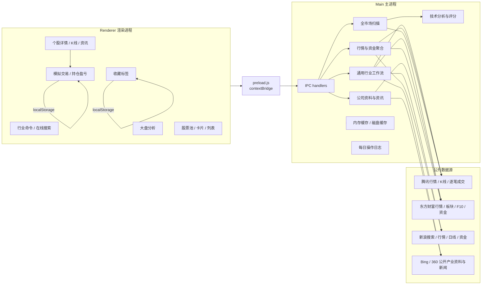
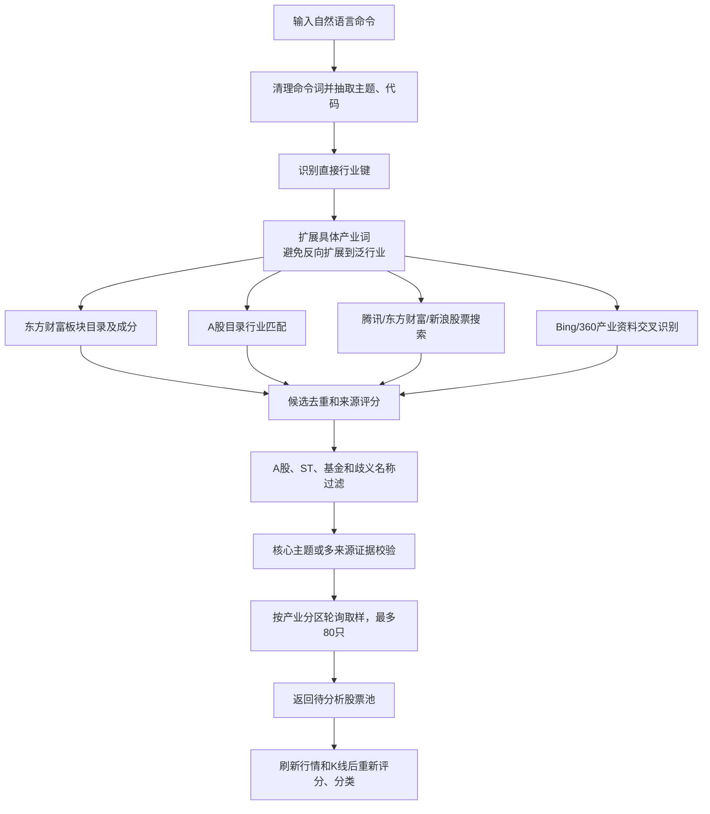
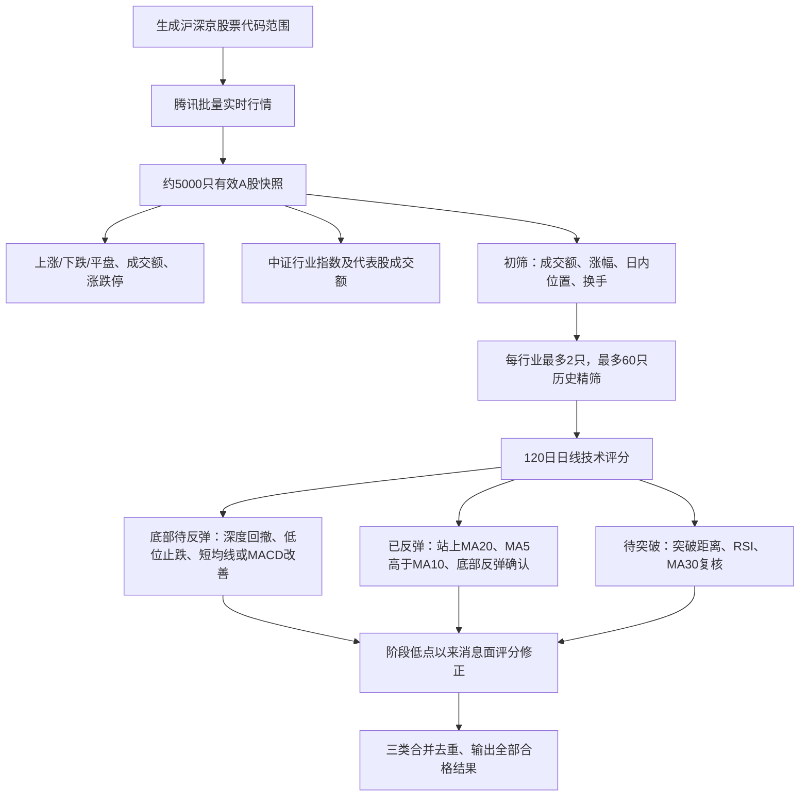

# AI 股票观察助手：项目架构、选股算法与数据接口

> 文档对应当前 Electron 工程。应用使用公开行情接口和本地规则分析，不接入外部 AI 模型。分析结果只用于条件观察，不构成投资建议。

## 1. 项目目标

应用提供五类能力：

1. 用自然语言行业命令生成本次股票池，例如半导体、白酒、猪肉、AI 算力租赁。
2. 搜索单只 A 股、查看实时行情、资金、公司资料、新闻和多周期走势。
3. 扫描全市场，分析大盘宽度、板块轮动、涨跌停，以及底部待反弹、已反弹和待突破候选股。
4. 用本地标签长期保存关注股票；主显示区不持久化，重启后保持为空。
5. 在个股详情执行本地模拟买卖，并按实时行情跟踪持仓、浮动盈亏和已实现收益。

## 2. 可视化架构



## 3. 工程结构

```text
ai-stock-assistant/
├─ main.js                 Electron 主进程、IPC、网络请求、分析算法
├─ preload.js              安全暴露 window.stockApi
├─ renderer.js             页面状态、交互、标签、图表和详情渲染
├─ index.html              页面结构
├─ styles.css              响应式布局和组件样式
├─ package.json            启动、测试和打包配置
├─ start.cmd               命令行一键启动
├─ 启动AI股票助手.vbs      隐藏 CMD 窗口启动
├─ tests/
│  ├─ smoke.test.js        真实接口与核心逻辑测试
│  └─ ui-smoke.js          Electron UI、输入、标签、图表和模拟交易回归测试
├─ cache/                  接口降级缓存
├─ logs/YYYY-MM-DD.log     每日详细操作与错误日志
├─ docs/                   项目文档
└─ release/                electron-builder 打包输出
```

## 4. 进程和数据边界

### 4.1 渲染进程状态

| 状态 | 用途 | 是否持久化 |
|---|---|---|
| `stocks` | 主显示区本次搜索、生成或详情数据 | 否 |
| `onlineSearchResults` | 当前线上搜索结果 | 否 |
| `labels` | 用户标签及标签内股票 | 是，`localStorage` |
| `activeLabel` | 当前标签 | 是 |
| `portfolio` | 模拟持仓数量、加权成本、已实现收益和最近行情快照 | 是，`localStorage` |
| `simulatedTrades` | 最近 500 笔模拟买卖成交记录 | 是，`localStorage` |
| `detailHistoryCache` | 当前进程内技术分析结果 | 否 |
| `lastStatusNotice` | 角落状态提示 | 否 |

生成股票池和线上搜索只清理主显示区，不删除标签。股票保存到新标签时采用增量合并，同一股票可同时存在于多个标签。

模拟交易按 A 股 100 股整数手计算。买入和卖出默认使用当前价格，买入使用持仓加权平均成本；卖出默认全部持仓，也可快速选择 1/4、1/3、1/2 或全部，卖出数量不能超过当前持仓，并累计已实现收益。持仓浮动盈亏使用最近一次实时行情计算，不模拟手续费、账户余额和交易所撮合。持仓页支持单独刷新、全选/取消全选，以及按每只买入金额或统一卖出比例进行批量交易。

### 4.2 IPC 接口

| IPC 名称 | 用途 |
|---|---|
| `run-industry-workflow` | 解析命令并生成本次行业股票池 |
| `search-a-share-stocks` | 多源搜索 A 股 |
| `fetch-a-share-quotes` | 批量刷新实时行情和市值 |
| `fetch-stock-fund-flow` | 汇总主力流入、流出、净额和占比 |
| `fetch-stock-history` | 获取近 120 日行情并计算技术分析 |
| `fetch-stock-chart` | 获取分时、五日、日 K、周 K、月 K |
| `fetch-stock-news` | 获取并倒序整理个股资讯 |
| `fetch-company-profile` | 获取行业、主营、主营构成和公司概况 |
| `fetch-market-overview` | 全市场大盘、轮动和突破候选扫描 |
| `open-external-url` | 仅允许打开 HTTP/HTTPS 链接 |
| `append-operation-log` | 写入当天本地日志 |

## 5. 通用行业命令算法



### 5.1 命令解析

- 删除“查找、生成、股票、行业、产业链、龙头、待突破”等操作词。
- 识别六位股票代码和核心主题。
- “半导体全产业链”会得到主题“半导体”，不会保留尾部“全”。
- 当命令同时包含 `AI` 和更具体的 `算力租赁` 时，以具体产业为主，不扩展到所有 AI 应用。
- 直接行业键优先，防止“白酒”反向命中泛化的“食品饮料”。
- 对地点加设施类命令进一步拆分实体。例如“惠州平潭机场”拆为地点“惠州、平潭”、设施“机场”，再扩展机场运营、建设、飞行区、航站楼、空港交通、航空物流、临空经济和低空通航等关系。
- 地点或名称相同不等于业务关联。只有代码/公司名与实体关系在局部公开资料中共同出现，或命中已核验的关系图谱时才提高相关性；纯名称关联必须标为“待核验”。
- 设施类搜索排除只做航线运营、但没有设施运营/建设证据的航空公司，避免“机场”误返回普通航空公司。
- 地点设施查询优先使用地点专属关系，不再把通用机场清单无条件混入所有城市。例如“大连金州机场”使用大连金州湾机场的公开中标/参建关系，与“惠州平潭机场”结果分离。
- “深圳南宁高铁”一类线路搜索会拆分起终点和设施类型，并返回铁路建设、车辆、牵引、信号、供电、运维等通用产业链；没有项目级证据时必须明确标注“不代表已参与或中标”。

### 5.2 候选来源和相关性

候选按以下来源合并，同代码保留更高相关性版本：

1. 命令明确指定代码：相关性 200。
2. 精确或高相关板块成分：基础 80 加板块匹配分。
3. A 股目录的名称、行业、地区文本匹配。
4. 腾讯、东方财富、新浪关键词搜索。
5. Bing 和 360 的独立搜索结果及公开页面交叉识别。
6. 仅当结果严重不足时使用少量行业种子，种子不替代通用搜索流程。

公开资料识别要求股票名称或代码与产业词出现在同一局部上下文中。核心主题命中可直接保留；单一主题下，四字以上的明确产业词可单来源保留；复合主题只允许主题包含的直接产业词单来源保留，其他扩展词仍须至少两处证据。股票名称若本身等于另一个行业普通词，例如“机器人”“农产品”，且不属于当前命令，不使用名称命中。

### 5.3 过滤和分区

- 默认只保留六位 A 股代码，排除指数、ETF、基金、转债、ST 和退市标记。
- 用户明确搜索 ETF/QDII 等产品时才允许基金结果。
- 对候选再次执行命令相关性校验，防止搜索页面相邻文本串入。
- 结果按产业分区进行轮询取样，避免一个板块占满列表。
- 最大返回 80 只；这不是固定目标数，实际数量取决于公开数据和证据质量。

## 6. 个股技术分析与评分

`analyzeHistory` 使用最近最多 120 个交易日的前复权日线，并合并当天腾讯最新行情。核心指标包括：

- MA5、MA10、MA20、MA30、MA60。
- 近 5、20、60 日收益率。
- RSI14、MACD DIF/DEA/柱值。
- 布林带 20 日上下轨。
- ATR14、20 日年化波动和区间最大回撤。
- 当日量比、近 5 日均量相对 20 日均量。
- 20 日前高突破价和多均线支撑价。

分时图使用蓝色价格线、橙色累计成交量加权均价线，并以昨收绘制 0.00% 横线。五日、日 K、周 K、月 K 显示最新收盘价及相对上一交易日或上一周期收盘的涨跌幅。全部图表支持十字光标：鼠标悬停预览，点击锁定后滑动切换数据点，触屏拖动同样可用；浮层显示日期、开盘、最高、最低、收盘、收盘涨跌幅和成交量，键盘左右键可逐点查看，`Esc` 取消锁定。

### 6.1 评分权重

| 条件 | 分值 |
|---|---:|
| 收盘价高于 MA20 | +12 |
| 收盘价高于 MA30 | +8 |
| 收盘价高于 MA60 | +6 |
| MA5 > MA10 | +8 |
| MA10 > MA20 | +8 |
| MA20 > MA30 | +6 |
| MA30 > MA60 | +6 |
| 距 20 日突破位在 -1.5% 至 +4% | +18 |
| 当日量比 1.1 至 2.8 | +14 |
| 当日量比 0.85 至 1.1 | +7 |
| RSI14 在 50 至 72 | +8 |
| MACD 柱值为正 | +6 |
| RSI > 80、过度偏离突破位或量比 > 4 | -18 |

最终评分限制在 0 至 100。评分只是规则强度，不代表上涨概率。

### 6.2 “已突破”状态

“已突破”不再依据单日涨幅或旧标签状态。刷新并完成历史分析后，必须同时满足：

1. 当前价高于 20 日突破价 0.3% 至 12%。
2. 技术评分不低于 65。
3. 当前价不低于 MA20，且 MA5 不低于 MA10。
4. 近 5 日收益不低于 -1%。
5. 当日量比不低于 0.9。

高于突破位超过 12% 且趋势仍强时标记为“突破后运行”；评分低于 45 或价格、短均线转弱时标记为“趋势偏弱”；接近突破位但尚未确认时标记为“待突破”。旧版本持久化的“已突破”在启动时先重置为“待分析”，避免过期结论继续显示。

### 6.3 龙头和关注分类

- 评分不低于 72：重点关注。
- 评分 55 至 71：趋势关注。
- 评分低于 55：观察关注。
- 同一产业分区至少有 3 只股票时，结合总市值或成交额选取分区代表；没有实时数据前不按数组顺序硬标“龙头”。

## 7. 全市场大盘与技术形态推荐



### 7.1 全市场初筛

- 排除 ST、退市标记和当日涨幅不合理的标的。
- 成交额至少 5000 万元。
- 当日涨幅在 -1% 至 9.5% 之间。
- 当前价至少达到日内最高价的 96%。
- 换手率 0.5% 至 12% 获得额外初筛权重。
- 每个已知行业初筛最多取 2 只，最多对 60 只执行 120 日历史精筛。

### 7.2 突破推荐复核

- 距 20 日突破位在已突破 2.5% 到尚差 5% 之间。
- RSI14 小于 80。
- 当前价不低于 MA30 的 98%。
- 按推荐评分排序；通过算法与质量闸门的股票全部输出，不再设置分类数量或页面展示上限。
- 突破与反弹使用独立质量闸门，突破股不会再因“反弹评分不足”被误删；兼具多类信号时优先标记突破，并按待突破、已反弹、底部待反弹轮询混排，避免首页被单一类型占满。
- 页面分类数量只按最终去重、质量过滤后的推荐列表计算，三类数量之和必须等于“实际推荐”总数；去重前的候选数量仅保留在内部诊断字段中。
- 大盘推荐加入标签后，形态标签和消息标签保留推荐时快照；行情刷新只更新价格、评分和分析正文，不把“待突破”覆盖为冲突的“已突破”标签。
- 最新消息出现风险词时，将“可关注”降为“等待确认”。

### 7.3 底部反弹识别

反弹算法只使用全市场快照初筛后的 120 日日线，不依赖手工股票名单。最近 20 个交易日内寻找阶段低点，并回看低点前的 60 日高点：

- “底部待反弹”要求前高到低点回撤至少 18%，当前仍处于 60 日区间较低位置，自低点反弹不超过 12%，近 5 日未继续急跌，并且 MA5/MA10 或 MACD 柱至少一项开始改善；仍需站稳 MA20 和成交量确认。
- “已反弹”要求前高到低点回撤至少 18%，自低点反弹 6% 至 80%，现价站上 MA20、MA5 高于 MA10、RSI 未过热，MACD 为正或持续改善。
- 反弹评分综合回撤深度、低点时效、区间位置、MA5/MA10 斜率、MA20 修复、MACD、RSI 和量能；最终限制在 0 至 100。
- `002407`、`600667`、`600111`、`002428`、`002842` 的 2026-08-03 前后走势作为回归样本，但生产扫描不硬编码这些代码。
- 反弹候选还必须通过质量闸门：综合股价、成交额、市值、PE、PB、换手率、20 日趋势、近 5 日量能、回撤深度和反弹评分。低于 3 元、极端估值、流动性不足或仅轻微超跌的弱修复股票会被大幅降分；`600157` 作为误报回归样本，但规则不按代码拉黑。

### 7.4 消息面修正

- 反弹类只统计阶段低点以来的个股资讯，突破类统计近 21 天资讯。
- 业绩增长/预增/扭亏、回购/增持、中标/签约、获批、订单和政策补贴等积极词使信号评分增加 8 分，并显示“消息确认”。
- 减持、立案、处罚、亏损、诉讼、退市、质押、问询和警示等风险词使信号评分降低 16 分，并显示“消息谨慎”；原“可关注”降为“等待确认”。
- 无明确倾向或无可核验消息时显示“消息中性”。消息只修正技术信号，不单独触发推荐。

### 7.5 推荐股批量加入标签

大盘“技术形态推荐”首页只显示评分排序后的前 10 条；“查看更多”打开全部推荐与一键保存弹窗。弹窗顶部选择已有标签或创建新标签，下方按与首页一致的列表格式展示全部推荐数据和信号标签。推荐股默认全选，同一按钮在“全选/取消全选”之间切换；用户可以逐只多选、选择多个已有标签或创建新标签，保存时按股票代码去重并保留已有置顶状态。

推荐卡、个股详情和标签列表统一以“推荐评分”为主评分；技术面原始分只保留为内部计算字段，刷新详情不会覆盖消息面修正后的推荐评分。

## 8. 走势和资讯容错

- 腾讯日/周/月 K 线使用 `ifzq.gtimg.cn` 稳定域名；日 K 请求失败时退回新浪日线。
- HTTP 请求最多跟随 3 次 301/302/303/307/308 重定向，避免把正常跳转直接显示为错误。
- 大盘消息优先使用东方财富资讯，Bing 仅作备用；两者都不可用时按无消息处理，不把空资讯误报成“部分数据异常”。
- “个股走势”刷新按钮会强制绕过缓存重新请求当前周期，失败后按钮恢复可用，可继续重试。

大盘页面每 60 秒请求一次最新分析；手动刷新强制绕过 30 秒内存缓存。若全市场请求失败，界面明确显示错误，不把历史磁盘缓存冒充实时大盘。

## 9. 数据接口清单

这些均为公开网页接口，不是正式商业数据服务，字段和可用性可能变化。

| 数据源 | 接口形态 | 当前用途 | 降级策略 |
|---|---|---|---|
| 腾讯 | `qt.gtimg.cn/q=...` | 个股、指数、全市场实时行情和市值 | 分批重试；个股再降级东方财富、单股接口、新浪、缓存 |
| 腾讯 | `smartbox.gtimg.cn/s3/` | 股票名称/代码搜索 | 东方财富搜索、A股目录、新浪搜索、内置精确种子 |
| 腾讯 | `web.ifzq.gtimg.cn/appstock/app/fqkline/get` | 前复权日/周/月 K 线 | 日线降级到新浪 |
| 腾讯 | `ifzq.gtimg.cn/appstock/app/kline/mkline` | 分时和五日走势 | 请求失败时详情显示明确错误 |
| 腾讯 | `stock.gtimg.cn/data/index.php` | 逐笔成交和资金流估算 | 东方财富/新浪资金接口失败后使用，并标注估算口径 |
| 东方财富 | `push2.eastmoney.com/api/qt/ulist.np/get` | 批量行情、资金和市值补充 | 腾讯优先，失败保留错误明细 |
| 东方财富 | `push2.eastmoney.com/api/qt/stock/get` | 单股行情补充 | 新浪实时行情、缓存 |
| 东方财富 | `push2.eastmoney.com/api/qt/clist/get` | A股目录、板块目录和板块成分 | 分页、局部成功合并旧缓存 |
| 东方财富 | `push2.eastmoney.com/api/qt/slist/get` | 个股所属板块 | F10 或已有可靠行业 |
| 东方财富 | `emweb.securities.eastmoney.com/PC_HSF10/...` | 公司概况、经营范围、主营构成 | 返回缺失时显示“接口未提供” |
| 东方财富 | `search-api-web.eastmoney.com/search/jsonp` | 个股资讯 | Bing 新闻 RSS |
| 新浪 | `hq.sinajs.cn/list=...` | 实时行情降级 | 缓存并标记非实时 |
| 新浪 | `suggest3.sinajs.cn/suggest/...` | 股票搜索降级 | 本地精确种子 |
| 新浪 | `quotes.sina.cn/...getKLineData` | 日线降级 | 历史不足时停止技术结论 |
| 新浪 | `MoneyFlow.ssl_qsfx_zjlrqs` | 资金流补充 | 腾讯逐笔估算 |
| Bing | 网页搜索、新闻 RSS | 产业资料、公司新闻、大盘消息 | 360 搜索或返回部分结果 |
| 360 | `so.com/s?q=...` | 中文产业资料交叉识别 | Bing 结果、板块和目录结果 |

### 9.1 主力资金口径

优先采用公开资金接口。接口不可用时，腾讯逐笔成交按单笔金额阈值估算主力流入和流出。该结果不等同于 Level-2 机构账户数据，界面会展示来源和“估算”说明。主力净占比按主力净额除以成交额计算。

## 10. 缓存、日志和错误处理

### 10.1 缓存

- 行情、历史、资讯、公司资料使用不同有效期的进程内缓存。
- `cache/stock-directory.json`：东方财富 A 股目录。
- `cache/board-directory.json`：板块目录。
- `cache/board-stocks-*.json`：板块成分。
- `cache/tencent-stock-directory.json`：最近完整腾讯全市场名称快照，仅用于行业关联识别。
- `cache/market-overview.json`：最近大盘结果，保存用于诊断，不作为实时成功结果冒充展示。

### 10.2 日志

日志文件为 `logs/YYYY-MM-DD.log`，每天一个文件。每条包含：

- 精确到秒的时间。
- 日志级别、操作名和动作标识。
- 命令、关键词、来源、数量、部分成功信息。
- 网络错误、HTTP 状态、超时、socket hang up/ECONNRESET。
- 错误堆栈摘要。

界面不展示日志列表，只在右下角显示不影响布局的成功或异常提示。

## 11. 启动、测试和打包

```powershell
Set-Location D:\AICodes\ai-stock-assistant
npm start
```

隐藏 CMD 启动：双击 `启动AI股票助手.vbs`。

```powershell
npm test          # 真实接口和核心逻辑
npm run test:ui   # Electron UI 回归
npm run dist      # 生成 Windows 便携版
```

便携版输出到 `release/`。应用窗口关闭后 Electron 主进程退出，不保留后台行情进程。

## 12. 已知边界

1. 公开网页接口可能限流、403、断开连接或调整字段；程序保留多源降级和详细日志，但无法保证第三方接口永久可用。
2. 行业关联是“板块数据 + 目录 + 公开资料证据”的规则结果，不等于交易所官方行业分类。
3. 新闻情绪使用风险/利好关键词做规则摘要，不是大语言模型语义判断。
4. 入场、离场窗口是条件触发提示，不是对未来价格和日期的保证。
5. 非交易时段的最新行情通常是上一交易日收盘数据，界面以数据源返回的交易日为准。

## 13. 本次升级验收要点

- 大盘推荐不限制合格结果总数，首页只展示前 10 条，“查看更多”展示全部并支持批量保存。
- 推荐统计按最终去重列表计算；统计总数与待反弹、已反弹、待突破三类之和一致。
- 推荐卡、详情和收藏使用同一推荐形态、消息标签及推荐评分；“待突破”不会在收藏后被刷新成冲突的“已突破”。
- 走势请求支持 HTTP 重定向、日线降级和手动重试；失败不会让刷新按钮永久不可用。
- 模拟持仓支持默认成交参数、快捷卖出、持仓刷新和批量买卖，布局保持紧凑。
- 行业搜索已覆盖地点机场差异化关系和“深圳南宁高铁”线路产业链，并明确区分通用产业关联与项目中标证据。
- 核心逻辑使用 `npm test` 验证，Electron 交互使用 `npm run test:ui` 验证。
